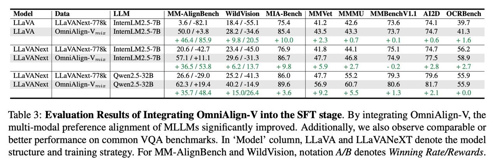

# Image Description

**File:** img_1772876206_aqadqhzrgzqoul_table_3_evaluation_results_of_integratin.jpg
**Original:** image.jpg
**Received:** 1772876206

## Extracted Text (OCR)

Table 3: Evaluation Results of Integrating OmniAlign-V into the SEI stage. By integrating OmniAlign-V, the multi-modal preference alignment of MLLMss significantly improved. Additionally, we also observe comparable ог better performance on common VQA benchmarks. In 'Model' column, LLaVA and LLaVANeXT denote the model structure and training strategy. For MM-AlignBench and WildVision, notation А/В denotes Winning Rate/Rewards.

|                                                                                                      | Model | Data | LLM | MM-AlignBench WildVision MIA-Bench |MMVet MMMU MMBenchV1.1 AI2D OCRBench   |
|------------------------------------------------------------------------------------------------------|-------------------------------------------------------------------------------------------------|
| Lia VA  | LLaVANext-//6k | IntemLM2.5-/5 |  3.6 / -62,1  16.4 /-39.1  45.4  41.2  42.0  13.0  14.1   |                                                                                                 |
| LLaVA | OmniAlign-V iz | InternLM2.5-7B | 50.0 / +3.8 28.2 / -34.6 85.4 | 43.5 43.3 73.7 74.7 41.3   |                                                                                                 |
| LLaVANext | LLaVAWNext-778k | Intern].M?.5-7B 90.6 /-47.7 934/450 16.9 AI & аа] 7% | 7A TF 56.2      |                                                                                                 |
| LLaVANext | OmniAlign-V,,i2. | IntenLM2.5-7B | 57.1/+11.1  29.6/-31.3 867 | 47.7 46.8 74.9 77.5 58.9 |                                                                                                 |
|                                                                                                      | ЯТ                                                                                              |
| LLaVANext | LLaVANext-778k | Owen2.5-32B | 26.6/-29.0 25.2 / 41.3 86.0 | 477 55.2 79.3 79.6 55.9     |                                                                                                 |
| LLaVANext | OmniAlign-Vmiz | Qwen2.5-32B | 62.3/4+194 40.2/-149 896 | 569 60.7 80.6 81.7 55.9        |                                                                                                 |

## Usage Instructions

When referencing this image in markdown:
1. Use relative path based on file location
2. Add descriptive alt text based on OCR content above
3. Add text description BELOW the image for GitHub rendering

Example:
```markdown
 <!-- TODO: Broken image path -->

**Image shows:** [Describe what the image contains based on OCR]
```
