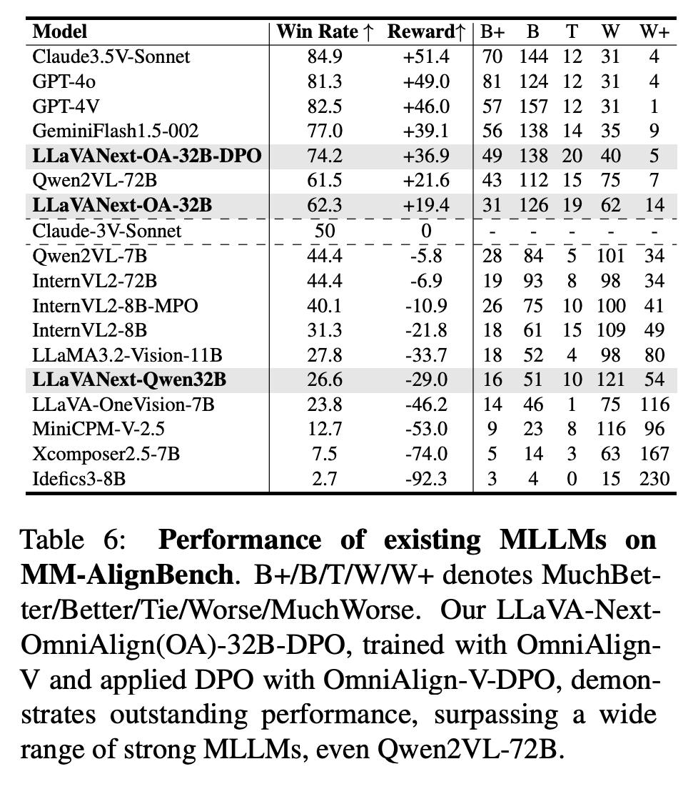

# Image Description

**File:** img_1772876206_aqadrbzrgzqoul_table_6_performance_of_existing_mllms.jpg
**Original:** image.jpg
**Received:** 1772876206

## Extracted Text (OCR)

Table 6: Performance of existing MLLMs on MM-AlignBench. B+/B/T/W/W-+ denotes MuchBetter/Better/lie/Worse/MuchWorse. От LLaVA-NextOmniAlign(OQA)-32B-DPO, trained with OmniAlignV and applied DPO with OmniAlign- V-DPO, demonstrates outstanding performance, surpassing a wide range of strong MLLMs, even Qwen2VL-7/2B.

|                                                        | Win Rate  +1 Rewardt!B+ В TT W W+   |
|--------------------------------------------------------|-------------------------------------|
| (Clande3.5V-Sonnet                                     |                                     |
| (;PT-40 813 +490 | ®] 134 17 3] 4                      |                                     |
| ae)  +460  157 157 12 31  ]                            |                                     |
| 77.0                                                   |                                     |
| LLaVANext-OA-32B-DPO | 742 +369 |149 138 20 40 5       |                                     |
| Owen2VL-/2B | 61.5 +21.6 | 43 112 15 7/5 7             |                                     |
| LLaVANext-OA-32B |1 62.3 +194 |3] 126 19 62 14         |                                     |
| -Claude-3V-Sonnet                                      |                                     |
| Qwen2VL-7B  # }3}}3| | 444 -§8 |28 84 5 101 34         |                                     |
| Intern V L.2-/2B 44 4 -69 i|19 95S в 9% 34             |                                     |
| InternVL?-8B                                           |                                     |
| LLaMA3.2-Vision-11B | OTS -337 | 18 52 4 9 53          |                                     |
| LLaVANext-Qwen32B | = 26.6 -29.0 |16 51 10 121 54      |                                     |
| L_TaVA-OneVision-/B  723 ©  -46 2  | 14 46  1  7%“ 116 |                                     |
| MiniCPM-V-2.5  | 9                                     |                                     |
| Xcomposer2.5-7B | 7.5 -74.0 |5 14 3 63 167             |                                     |

## Usage Instructions

When referencing this image in markdown:
1. Use relative path based on file location
2. Add descriptive alt text based on OCR content above
3. Add text description BELOW the image for GitHub rendering

Example:
```markdown
 <!-- TODO: Broken image path -->

**Image shows:** [Describe what the image contains based on OCR]
```
