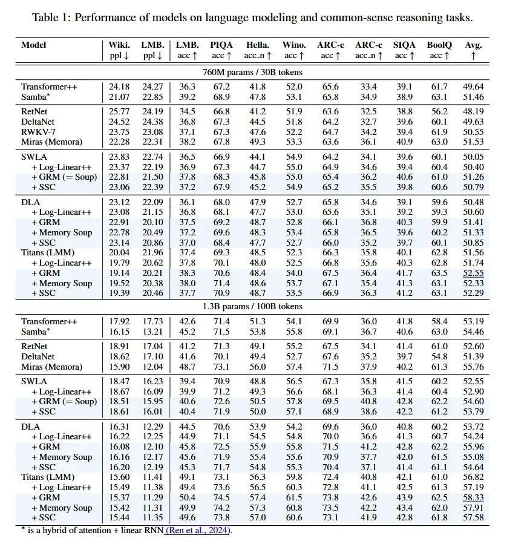

# Image Description

**File:** img_1772892121_aqadkhzrg0npyel_table_1_performance_of_models_on.jpg
**Original:** image.jpg
**Received:** 1772892121

## Extracted Text (OCR)

Table 1: Performance of models on language modeling and common-sense reasoning tasks.

|                                                                                                                                                                                                                   | Model  | Wiki.  LMB. | LMB.  НОА Hella.  Wino.  ARC-e ARC-c  SIQA Bool) Avg. ppl |  ppl | | accT  accT accnT  асс T  acc T  ассп{1 acct  acc T  T   |                          |                          |                          |                          |                          |                          |                          |                          |                          |                          |
|-------------------------------------------------------------------------------------------------------------------------------------------------------------------------------------------------------------------|-----------------------------------------------------------------------------------------------------------------------------------------------------|--------------------------|--------------------------|--------------------------|--------------------------|--------------------------|--------------------------|--------------------------|--------------------------|--------------------------|--------------------------|
| {GUM params / 306 tokens                                                                                                                                                                                          | {GUM params / 306 tokens                                                                                                                            | {GUM params / 306 tokens | {GUM params / 306 tokens | {GUM params / 306 tokens | {GUM params / 306 tokens | {GUM params / 306 tokens | {GUM params / 306 tokens | {GUM params / 306 tokens | {GUM params / 306 tokens | {GUM params / 306 tokens | {GUM params / 306 tokens |
| Transtonmmer+-- | АЯ B34 77 | 363 O77? Al] & 70 $5 & 43.4 39 | O17 £40 64 Transformer++ 24.18 24.27 36.3 67.2 41.8 52.0 55.6 334 39.1 61.7 49.64 Samba* 21.07 22.85 39.2 68.9 47.3 53.1 65.8 34.9 38.9 63.1 51.46 |                                                                                                                                                     |                          |                          |                          |                          |                          |                          |                          |                          |                          |                          |
| eth  =                                                                                                                                                                                                            |                                                                                                                                                     |                          |                          |                          |                          |                          |                          |                          |                          |                          |                          |
| мита (Memora) 122.28 224,351 | 38.4 7.5 49.3 533 53.6 36.1 9 635.0 5.53                                                                                                                                           |                                                                                                                                                     |                          |                          |                          |                          |                          |                          |                          |                          |                          |                          |
| АТ А | 73 835 174 | 3655 460 Ad | 44 9 |: ЗА | 36 #1 50) (5                                                                                                                                                       |                                                                                                                                                     |                          |                          |                          |                          |                          |                          |                          |                          |                          |                          |
| + Loe-Linear++ | 23.27 224.19 | 364 Os.4 Aas 25.9 04.4 34.0 39.8 604 3990                                                                                                                                         |                                                                                                                                                     |                          |                          |                          |                          |                          |                          |                          |                          |                          |                          |
| ОМ (=—soup) | 22.81 2150 | 37% 68.3 45.5 350 63.4 30.2 450.6 610 51.24                                                                                                                                            |                                                                                                                                                     |                          |                          |                          |                          |                          |                          |                          |                          |                          |                          |
| + Ser  349  65 7                                                                                                                                                                                                  |                                                                                                                                                     |                          |                          |                          |                          |                          |                          |                          |                          |                          |                          |
| DLA  57  658                                                                                                                                                                                                      |                                                                                                                                                     |                          |                          |                          |                          |                          |                          |                          |                          |                          |                          |
| AL 23.12 22.09 | 36.1 68.0 479 32.7 65.8 34.6 39.1 59% 50.48 + Log-Linear++- 23.08 21.15 36.8 68.1 47.7 53.0 65.6 35.1 39.2 29.3 50.60                                                                            |                                                                                                                                                     |                          |                          |                          |                          |                          |                          |                          |                          |                          |                          |
| + Метогу Soup | 2278 2049 | 37.2 69.6 48.3 53.4 65.5 36.5 39.6 60.2 51.33                                                                                                                                         |                                                                                                                                                     |                          |                          |                          |                          |                          |                          |                          |                          |                          |                          |
| ‘Titans (LMI)  ) 204  £1.96 |  af 4  OY.3  45.7  PFS,  bO.3  3.6  62.6  51.36                                                                                                                                     |                                                                                                                                                     |                          |                          |                          |                          |                          |                          |                          |                          |                          |                          |
| ans (LMM) 20.04 21.96 37.4 69.3 48.5 52.3 66.3 35.8 30.1 62.8 51.56 + Log-Linear++ 19.79 = 20.62 37.8 70.1 48.0 52.5 66.8 35.6 40.3 62.8 41.74                                                                    |                                                                                                                                                     |                          |                          |                          |                          |                          |                          |                          |                          |                          |                          |
| +Memory Soup | 19.52 20.38 | 380 71.4 48.6 53.7 67.1 35.4 413 63.1 52.33                                                                                                                                          |                                                                                                                                                     |                          |                          |                          |                          |                          |                          |                          |                          |                          |                          |
| hb                                                                                                                                                                                                                |                                                                                                                                                     |                          |                          |                          |                          |                          |                          |                          |                          |                          |                          |
| 1.35 params / НВ tokens                                                                                                                                                                                           | 1.35 params / НВ tokens                                                                                                                             | 1.35 params / НВ tokens  | 1.35 params / НВ tokens  | 1.35 params / НВ tokens  | 1.35 params / НВ tokens  | 1.35 params / НВ tokens  | 1.35 params / НВ tokens  | 1.35 params / НВ tokens  | 1.35 params / НВ tokens  | 1.35 params / НВ tokens  | 1.35 params / НВ tokens  |
| ‘Transtormer-+ Transformer++ 1792 17.73 42.6 71.4 51.3 54.1 69.9 36.0) 41.8 58.4 33.19 Samba* 16.15 = 13.21 45.2 71.5 53.8 55.8 69.1 36.7 40.6 63.0 54.46                                                         |                                                                                                                                                     |                          |                          |                          |                          |                          |                          |                          |                          |                          |                          |
| мигая Метога) | 15.90 TAMA | 45.7 3. SO.) 5/4 УЕ. 37 та O15 945.                                                                                                                                                  |                                                                                                                                                     |                          |                          |                          |                          |                          |                          |                          |                          |                          |                          |
| + Log-Lineart++ | 15.67 1609 | 39.9 т. 493 56.6 65.1 36.3 41.4 $04 S52.)                                                                                                                                          |                                                                                                                                                     |                          |                          |                          |                          |                          |                          |                          |                          |                          |                          |
| +4+GKRM(=soup) | 1852 15.95 | 4b 12% 50.5 57.8 oY 4G 42.6 62.2 24.00                                                                                                                                              |                                                                                                                                                     |                          |                          |                          |                          |                          |                          |                          |                          |                          |                          |
| У А                                                                                                                                                                                                               |                                                                                                                                                     |                          |                          |                          |                          |                          |                          |                          |                          |                          |                          |
| A 16.3} 12.29 44.5 70.6 53.9 54.2 69.6 360 408 60.2 53.72 + Log-Linear++ 16.22 12.25 | 449 71.1 54.5 54.8 70.0 36.6 413 60.7 = 54.24                                                                              |                                                                                                                                                     |                          |                          |                          |                          |                          |                          |                          |                          |                          |                          |
| + Метогу soup | 1.1%  LZ.t/ | 43.0 РЕЯ 55.4 55.6 UL Е 42.0) 615 35.08                                                                                                                                             |                                                                                                                                                     |                          |                          |                          |                          |                          |                          |                          |                          |                          |                          |
| Titans (LMM) | 19.600 ТЯ 91 13. 50.3 59.8 12.4 4.8 4/.1 61.0  3b.82                                                                                                                                               |                                                                                                                                                     |                          |                          |                          |                          |                          |                          |                          |                          |                          |                          |
| ans (LMM) 15.60 1141 49.1 73.1 563 59.8 724 40.8 42.1 61.0 56.82 + Log-Linear++ 1549 11.38 49.4 73.6 56.5 60.3 72.8 41.1 42.5 61.3 457.19                                                                         |                                                                                                                                                     |                          |                          |                          |                          |                          |                          |                          |                          |                          |                          |
| + Метогу soup | 13.42 [1.51 | 49 14.2. 57.5 60.8 15.5 422 43.4 64.0 36.91                                                                                                                                         |                                                                                                                                                     |                          |                          |                          |                          |                          |                          |                          |                          |                          |                          |

“18 a hybrid of attention + linear RNN (Ren et al., 2024).

## Usage Instructions

When referencing this image in markdown:
1. Use relative path based on file location
2. Add descriptive alt text based on OCR content above
3. Add text description BELOW the image for GitHub rendering

Example:
```markdown
 <!-- TODO: Broken image path -->

**Image shows:** [Describe what the image contains based on OCR]
```
