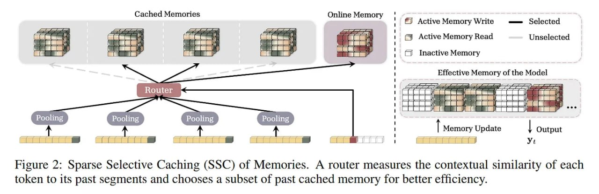

# Image Description

**File:** img_1772892121_aqadkrzrg0npyel_figure_2_sparse_selective_caching_ssc.jpg
**Original:** image.jpg
**Received:** 1772892121

## Extracted Text (OCR)

Figure 2: Sparse Selective Caching (SSC) of Memories. A router measures the contextual similarity of each token to its past segments and chooses a subset of past cached memory for better efficiency.

<!-- image -->

## Usage Instructions

When referencing this image in markdown:
1. Use relative path based on file location
2. Add descriptive alt text based on OCR content above
3. Add text description BELOW the image for GitHub rendering

Example:
```markdown
 <!-- TODO: Broken image path -->

**Image shows:** [Describe what the image contains based on OCR]
```
