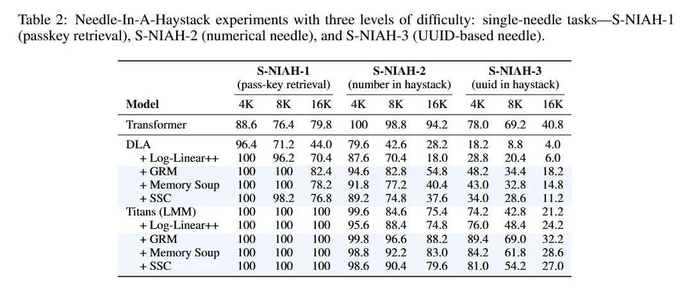

# Image Description

**File:** img_1772892121_aqadkxzrg0npyel_table_2_needle_in_a_haystack_experiments.jpg
**Original:** image.jpg
**Received:** 1772892121

## Extracted Text (OCR)

Table 2: Needle-In-A-Haystack experiments with three levels of difficulty: single-needle tasks—S-NIAH- | (passkey retrieval), S-NIAH-2 (numerical needle), and S-NIAH-3 (UUID-based needle).

|                                                    | (pass-Key retrieval) (numberin haystack)  (uuid in haystack)   | (pass-Key retrieval) (numberin haystack)  (uuid in haystack)   | (pass-Key retrieval) (numberin haystack)  (uuid in haystack)   |
|----------------------------------------------------|----------------------------------------------------------------|----------------------------------------------------------------|----------------------------------------------------------------|
| ‘Transtormer                                       |                                                                |                                                                |                                                                |
| +Log-Linear++ 100 96.2 1.4 8/6 jJO4 14 258.8 204   |                                                                |                                                                |                                                                |
| + GRM  Ц  874  946  82.5  S4  |.  18.2             |                                                                |                                                                |                                                                |
| + Метогу soup 100 ЦЮ 18.2 Эа ТАХ 404 43.0 32.5 14. |                                                                |                                                                |                                                                |
| ‘Titans (LMM) О ЦЮ Ц 99.6 3546 154 7/42 42.5 21.2  |                                                                |                                                                |                                                                |
| +Log-Linear++ 100 Ц 100 95.6 554 7/48 1709 464 242 |                                                                |                                                                |                                                                |
| +Memorysoup 100 ЦО ЦО 955 922 8354 642 0918 28.6   |                                                                |                                                                |                                                                |
| + 55  100  lOO  85  ЧА  19.6  51.0)  S54 9  2410   |                                                                |                                                                |                                                                |

## Usage Instructions

When referencing this image in markdown:
1. Use relative path based on file location
2. Add descriptive alt text based on OCR content above
3. Add text description BELOW the image for GitHub rendering

Example:
```markdown
 <!-- TODO: Broken image path -->

**Image shows:** [Describe what the image contains based on OCR]
```
