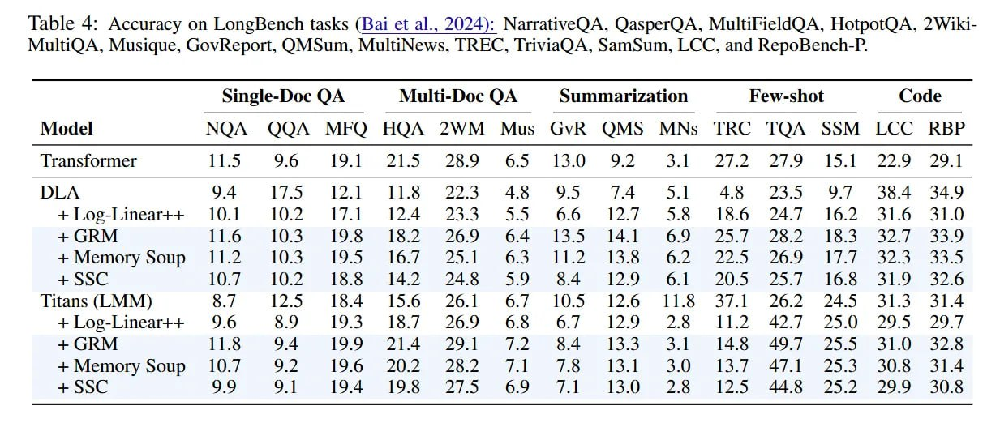

# Image Description

**File:** img_1772892121_aqadlhzrg0npyel_lable_4_accuracy_on_longbench_tasks.jpg
**Original:** image.jpg
**Received:** 1772892121

## Extracted Text (OCR)

lable 4: Accuracy on LongBench tasks (Bai et al., 2024): NarrativeQA, QasperQA, MultiFieldQA, HotpotQA, 2WikiMulttQA, Musique, GovReport, QMsum, MultiNews, TREC, TriviaQA, SamSum, LCC, and RepoBench-P.

|                                                                                | Single-Doc QA Multi-Doc QA Summarization Few-shot Code   | Single-Doc QA Multi-Doc QA Summarization Few-shot Code   | Single-Doc QA Multi-Doc QA Summarization Few-shot Code   |
|--------------------------------------------------------------------------------|----------------------------------------------------------|----------------------------------------------------------|----------------------------------------------------------|
| Model  NOA  QOQA MFO HOA 2WM Mus GvR OMS MNs IRC IQA SSM LCC RBP               |                                                          |                                                          |                                                          |
| ‘Transtormer                                                                   |                                                          |                                                          |                                                          |
| +Log-Linear++ 10.1 192 ПАРЕ 124 235 355 #66 12.7 5.6 16.60 24./ 16.2 510 31.0  |                                                          |                                                          |                                                          |
| + (sk M  11.6  103  19%  ]572  269  6.4  13.5  14 ]  25 7  16.3  ЗА.           |                                                          |                                                          |                                                          |
| + Метогу soup 11.2 103 195 tl6/ 2.1 0.3 112 15.05 62. 225 2609 ТЕГ s4.5 335    |                                                          |                                                          |                                                          |
| + SSC.  107  1} 72  15%  147  М. 5  SY  12.9  6.1  705 25]  16.8  41.9  427.6  |                                                          |                                                          |                                                          |
| titans (LMM) o./ [2.5 164 15.6 26.1 6/7 105 12.0 115 5/.| 262 245 31.5 314     |                                                          |                                                          |                                                          |
| + Log-Linear++ 9.6 5.9 19.5 15.2 2469 0.5 Of 129 2465 112 44/ 250 295 2!       |                                                          |                                                          |                                                          |
| + (;RM  11.8  YA  199 7) 4  AY |  ae.  14.3  ‘4. ]  14.8  497  23  41.0 3427.4 |                                                          |                                                          |                                                          |
| + Метогу soup 10./. 92 19.6 20.2 262 ЛЕ 1% 13.1 3.0 I13./ АРТ 23.5 30.86 31.4  |                                                          |                                                          |                                                          |
| 99  194  19.8  Pa Mi  6.9  130  р.  127.5  44 &  ZA 2  299 30.4                |                                                          |                                                          |                                                          |

## Usage Instructions

When referencing this image in markdown:
1. Use relative path based on file location
2. Add descriptive alt text based on OCR content above
3. Add text description BELOW the image for GitHub rendering

Example:
```markdown
 <!-- TODO: Broken image path -->

**Image shows:** [Describe what the image contains based on OCR]
```
