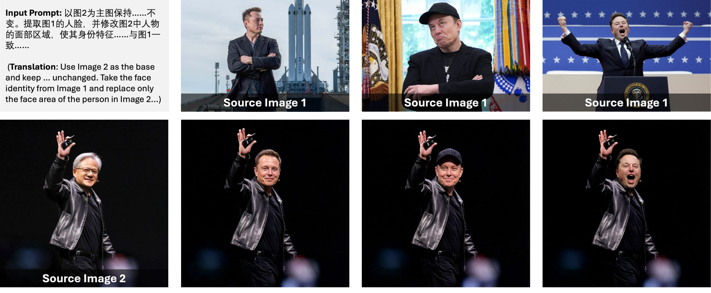

# Image Description

**File:** img_1773112995_aqadtbfrg2ouul8_input_prompt_25_548.jpg
**Original:** image.jpg
**Received:** 1773112995

## Extracted Text (OCR)

Input Prompt: 25-548...

о ЕЯХРАТНУ ЛДУ, FIBA Ss PAW |
SRA, PH ВИНЕ... 1— р. &amp; ni |.

(Iranslation: Use Image 2 as the base and keep ... unchanged. lake the face identity from Image 1 and replace only ne face area of the person in Image 2... Source Image 1 1 | Source Image 1 1 source Image 1

<!-- image -->

<!-- image -->

<!-- image -->

<!-- image -->

<!-- image -->

<!-- image -->

<!-- image -->

## Usage Instructions

When referencing this image in markdown:
1. Use relative path based on file location
2. Add descriptive alt text based on OCR content above
3. Add text description BELOW the image for GitHub rendering

Example:
```markdown
 <!-- TODO: Broken image path -->

**Image shows:** [Describe what the image contains based on OCR]
```
