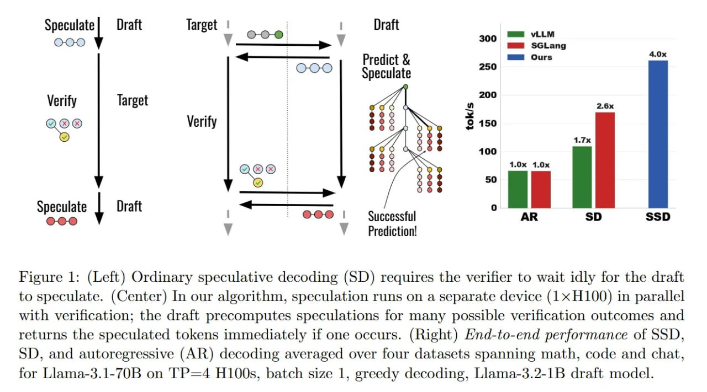

# Image Description

**File:** img_1773200981_aqadwhdrg0ugul_figure_1_left_ordinary_speculative_decod.jpg
**Original:** image.jpg
**Received:** 1773200981

## Extracted Text (OCR)

Figure 1: (Left) Ordinary speculative decoding (SD) requires the verifier to wait idly for the draft to speculate. (Center) In our algorithm, speculation runs on a separate device (1x H100) in parallel with verification; the drait precomputes speculations for many possible verification outcomes and returns the speculated tokens immediately if one occurs. (Right) End-to-end performance of SSD, SD, and autoregressive (AR) decoding averaged over four datasets spanning math, code and chat. for Llama-3.1-70B on ТР=4 H100s, batch size 1, greedy decoding, Llama-3.2-1B draft model.

<!-- image -->

## Usage Instructions

When referencing this image in markdown:
1. Use relative path based on file location
2. Add descriptive alt text based on OCR content above
3. Add text description BELOW the image for GitHub rendering

Example:
```markdown
 <!-- TODO: Broken image path -->

**Image shows:** [Describe what the image contains based on OCR]
```
