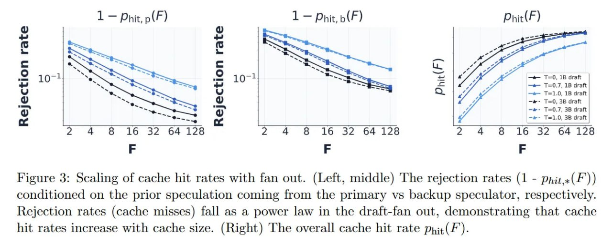

# Image Description

**File:** img_1773200981_aqadxbdrg0ugul_figure_3_scaling_of_cache_hit.jpg
**Original:** image.jpg
**Received:** 1773200981

## Extracted Text (OCR)

Figure 3: Scaling of cache hit rates with fan out. (Left, middle) The rejection rates (1 - ppit«(F)) conditioned on the prior speculation coming trom the primary vs backup speculator, respectively. Rejection rates (cache misses) fall as a power law in the draft-fan out, demonstrating that cache hit rates increase with cache size. (Right) The overall cache hit rate pi; (F').

<!-- image -->

## Usage Instructions

When referencing this image in markdown:
1. Use relative path based on file location
2. Add descriptive alt text based on OCR content above
3. Add text description BELOW the image for GitHub rendering

Example:
```markdown
 <!-- TODO: Broken image path -->

**Image shows:** [Describe what the image contains based on OCR]
```
