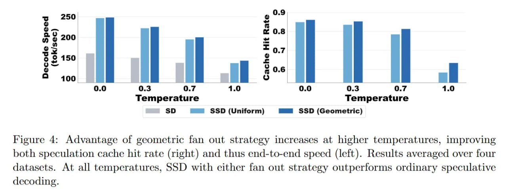

# Image Description

**File:** img_1773200981_aqadxrdrg0ugul_figure_4_advantage_of_geometric_fan.jpg
**Original:** image.jpg
**Received:** 1773200981

## Extracted Text (OCR)

Figure 4: Advantage of geometric fan out strategy increases at higher temperatures, improving both speculation cache hit rate (right) and thus end-to-end speed (left). Results averaged over four datasets. At all temperatures, SSD with either fan out strategy outperforms ordinary speculative decoding.

<!-- image -->

## Usage Instructions

When referencing this image in markdown:
1. Use relative path based on file location
2. Add descriptive alt text based on OCR content above
3. Add text description BELOW the image for GitHub rendering

Example:
```markdown
 <!-- TODO: Broken image path -->

**Image shows:** [Describe what the image contains based on OCR]
```
