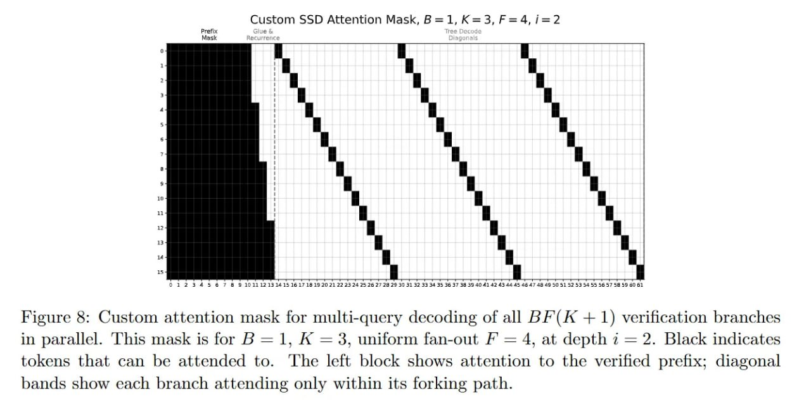

# Image Description

**File:** img_1773200981_aqadxxdrg0ugul_yyed_sutyiot_uiiim_atuo_sutpuo_ye.jpg
**Original:** image.jpg
**Received:** 1773200981

## Extracted Text (OCR)

'Yyed SUTYIOT т UIIIM ATUO SUTpUo}}ye добела Yovo моЧ$ spueqd JVuOSeIP .хЦцэла PoYLIoA 941 01 10149118 SMOYS YOoOTC YoT oT, '03 рэрчэ198 oq Wed 7841 $99301 воувотрат Youy\_ 'с = + YAdop ye 'ф = VF yno-uvy wsojiun '@ = у 'т = а до] SI узечт чат 'Joyyered ul сэцоиела WOTYEOYLIOA (1+ YW) 47g [ye Jo sutpooop АлэйЬ- [ит IO] узеит UOTJU9}}e 103815) :9 эм

<!-- image -->

## Usage Instructions

When referencing this image in markdown:
1. Use relative path based on file location
2. Add descriptive alt text based on OCR content above
3. Add text description BELOW the image for GitHub rendering

Example:
```markdown
 <!-- TODO: Broken image path -->

**Image shows:** [Describe what the image contains based on OCR]
```
