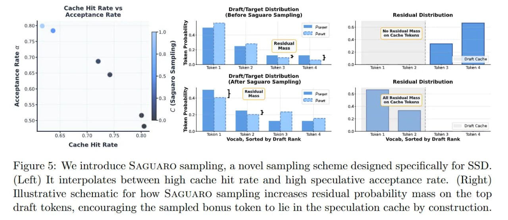

# Image Description

**File:** img_1773200981_aqadybdrg0ugul_figure_we_introduce_saguaro_sampling.jpg
**Original:** image.jpg
**Received:** 1773200981

## Extracted Text (OCR)

Figure о: We introduce SAGUARO sampling, a novel sampling scheme designed specifically for SSD. (Left) It interpolates between high cache hit rate and high speculative acceptance rate. (Right) Illustrative schematic for how SAGUARO sampling increases residual probability mass on the top draft tokens, encouraging the sampled bonus token to lie in the speculation cache by construction.

<!-- image -->

## Usage Instructions

When referencing this image in markdown:
1. Use relative path based on file location
2. Add descriptive alt text based on OCR content above
3. Add text description BELOW the image for GitHub rendering

Example:
```markdown
 <!-- TODO: Broken image path -->

**Image shows:** [Describe what the image contains based on OCR]
```
