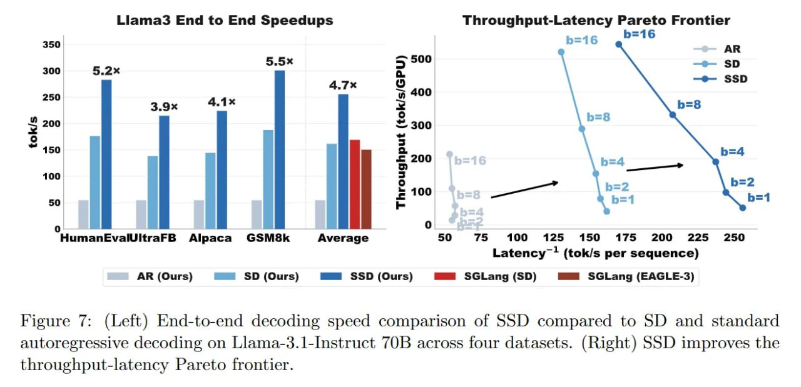

# Image Description

**File:** img_1773200981_aqadyhdrg0ugul_figure_7_left_end_to_end_decoding_speed.jpg
**Original:** image.jpg
**Received:** 1773200981

## Extracted Text (OCR)

Figure 7: (Left) End-to-end decoding speed comparison of SSD compared to SD and standard autoregressive decoding on Llama-3.1l-Instruct ТОВ across four datasets. (Right) SSD improves the throughput-latency Pareto frontier.

<!-- image -->

## Usage Instructions

When referencing this image in markdown:
1. Use relative path based on file location
2. Add descriptive alt text based on OCR content above
3. Add text description BELOW the image for GitHub rendering

Example:
```markdown
 <!-- TODO: Broken image path -->

**Image shows:** [Describe what the image contains based on OCR]
```
