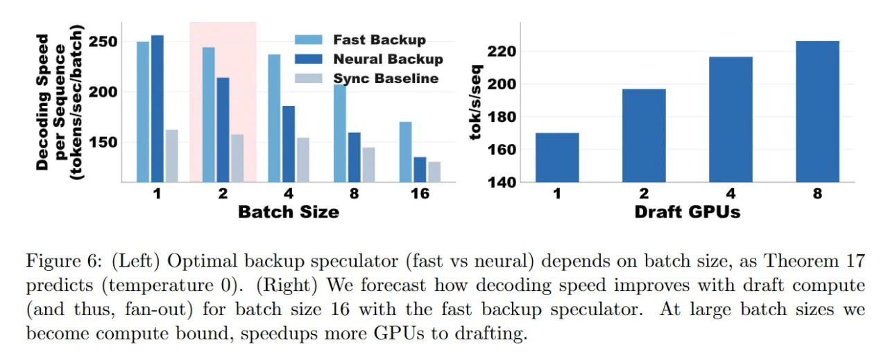

# Image Description

**File:** img_1773200981_aqadyrdrg0ugul_figure_6_left_optimal_backup_speculator.jpg
**Original:** image.jpg
**Received:** 1773200981

## Extracted Text (OCR)

Figure 6: (Left) Optimal backup speculator (fast vs neural) depends on batch size, as Theorem 17 predicts (temperature 0). (Right) We forecast how decoding speed improves with draft compute (and thus, fan-out) for batch size 16 with the fast backup speculator. At large batch sizes we become compute bound, speedups more GPUs to drafting.

<!-- image -->

## Usage Instructions

When referencing this image in markdown:
1. Use relative path based on file location
2. Add descriptive alt text based on OCR content above
3. Add text description BELOW the image for GitHub rendering

Example:
```markdown
 <!-- TODO: Broken image path -->

**Image shows:** [Describe what the image contains based on OCR]
```
