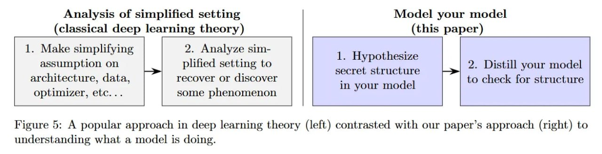

# Image Description

**File:** img_1773396590_aqad5hrrg0uiul_image_figure_5_a.jpg
**Original:** image.jpg
**Received:** 1773396590

## Extracted Text (OCR)

<!-- image -->

Figure 5: A popular approach in deep learning theory (left) contrasted with our paper's approach (right) to understanding what a model 1$ doing.

## Usage Instructions

When referencing this image in markdown:
1. Use relative path based on file location
2. Add descriptive alt text based on OCR content above
3. Add text description BELOW the image for GitHub rendering

Example:
```markdown
 <!-- TODO: Broken image path -->

**Image shows:** [Describe what the image contains based on OCR]
```
