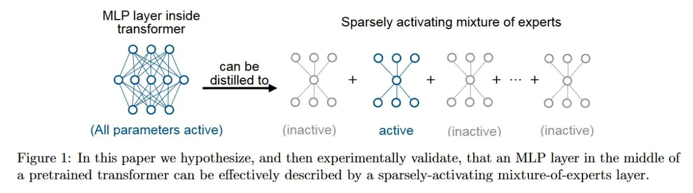

# Image Description

**File:** img_1773396590_aqad6brrg0uiul_figure_1_in_this_paper_we.jpg
**Original:** image.jpg
**Received:** 1773396590

## Extracted Text (OCR)

Figure 1: In this paper we hypothesize, and then experimentally validate, that an МЕР layer in the middle of a pretrained transformer can be eflectively described by a sparsely-activating mixture-ol-experts layer.

<!-- image -->

## Usage Instructions

When referencing this image in markdown:
1. Use relative path based on file location
2. Add descriptive alt text based on OCR content above
3. Add text description BELOW the image for GitHub rendering

Example:
```markdown
 <!-- TODO: Broken image path -->

**Image shows:** [Describe what the image contains based on OCR]
```
