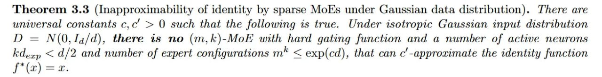

# Image Description

**File:** img_1773396590_aqad6rrrg0uiul_uoyouns_ayy_ayvucosddv_2_uno.jpg
**Original:** image.jpg
**Received:** 1773396590

## Extracted Text (OCR)

uoyouns Прииэр: ayy ayvucosddv- 2 uno yoy) '(po)dxe &gt; yu suoyninbhifuoo jadxra fo saquinu puv z%/p &gt; **py suoinau 904120 fo saquinu о puv uoyoun{ buizob pavy учит НоЙ-(у чи} ou st assay. '(p/PT'QO)N = а Uotngi.ssip риа upissnd®y) 2tdo1j0st дэрий 'эта я Duunozjof ay}, оу] цзи 0 &lt; 'oO syuD]SsUuOd POSsaarUN мо aLayT, *(WOTINGLIysIp eyep WeIssner) Jopun syoyy vsreds Aq Ayryuept jo Ayyiqeuirxoiddeuy) ее бэхоэцТ,

## Usage Instructions

When referencing this image in markdown:
1. Use relative path based on file location
2. Add descriptive alt text based on OCR content above
3. Add text description BELOW the image for GitHub rendering

Example:
```markdown
 <!-- TODO: Broken image path -->

**Image shows:** [Describe what the image contains based on OCR]
```
