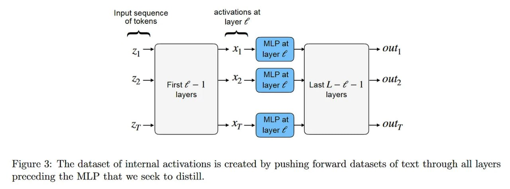

# Image Description

**File:** img_1773396590_aqad6xrrg0uiul_figure_3_the_datasct_of_internal.jpg
**Original:** image.jpg
**Received:** 1773396590

## Extracted Text (OCR)

Figure 3: 'The datasct of internal activations is created by pushing forward datascts of text through all layers preceding the MLP that we seek to distill.

<!-- image -->

## Usage Instructions

When referencing this image in markdown:
1. Use relative path based on file location
2. Add descriptive alt text based on OCR content above
3. Add text description BELOW the image for GitHub rendering

Example:
```markdown
 <!-- TODO: Broken image path -->

**Image shows:** [Describe what the image contains based on OCR]
```
