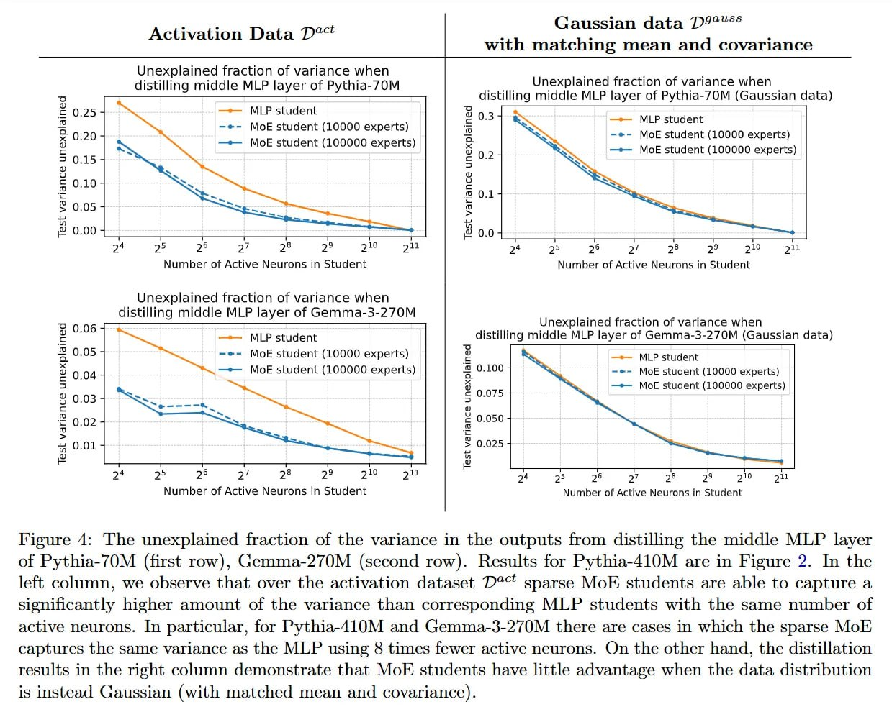

# Image Description

**File:** img_1773396590_aqad7brrg0uiul_activation_data_22_saussian.jpg
**Original:** image.jpg
**Received:** 1773396590

## Extracted Text (OCR)

## Activation Data 22"

## (saussian data 7297“?

## with matching mean and covariance

Figure 4: The unexplained fraction of the variance in the outputs Гош distilling the middle МЕР layer of Pythia-70M (first row), Gemma-270M (second row). Results for Pythia-410M are in Figure 2. In the left column, we observe that over the activation dataset D°" sparse MoF students are able to capture a sionificantly higher amount of the variance than corresponding МЕР students with the same number of active neurons. In particular, for Pythia-410M and Gemma-3-270M there are cases in which the sparse MoE captures the same variance as the МЕР using 8 times fewer active neurons. On the other hand, the distillation results in the right column demonstrate that MoE students have little advantage when the data distribution is instead Gaussian (with matched mean and covariance).

<!-- image -->

## Usage Instructions

When referencing this image in markdown:
1. Use relative path based on file location
2. Add descriptive alt text based on OCR content above
3. Add text description BELOW the image for GitHub rendering

Example:
```markdown
 <!-- TODO: Broken image path -->

**Image shows:** [Describe what the image contains based on OCR]
```
