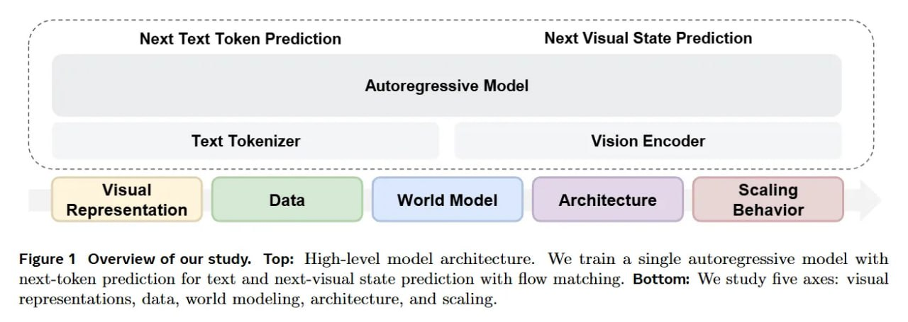

# Image Description

**File:** img_1773396664_aqadornrg7mmul_image_figure_1_overview.jpg
**Original:** image.jpg
**Received:** 1773396664

## Extracted Text (OCR)

<!-- image -->

Figure 1 Overview of our study. Top: High-level model architecture. We train a single autoregressive model with next-token prediction for text and next-visual state prediction with How matching. Bottom: We study five axes: visual representations, data, world modeling, architecture, and scaling.

## Usage Instructions

When referencing this image in markdown:
1. Use relative path based on file location
2. Add descriptive alt text based on OCR content above
3. Add text description BELOW the image for GitHub rendering

Example:
```markdown
 <!-- TODO: Broken image path -->

**Image shows:** [Describe what the image contains based on OCR]
```
