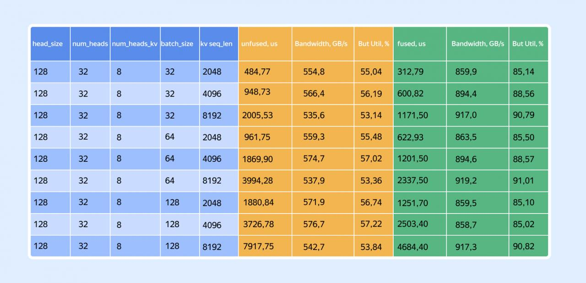

# Image Description

**File:** img_1773396728_aqadlhlrgutgul_bandwidth_gb_s_but.jpg
**Original:** image.jpg
**Received:** 1773396728

## Extracted Text (OCR)

|                                     | Bandwidth, GB/s | But Util, %   |
|-------------------------------------|---------------------------------|
| 484 77 5548 55 04                   |                                 |
| 128 32 8 32 4096 948,73 566.4 56.19 |                                 |
| | 2005 53 535 6 53 14               |                                 |
| 961 75 554 3 55 45                  |                                 |
| 1869.90 5/4,/ 57,02                 |                                 |
| 3994 28 537.9 53,36                 |                                 |
| 1880 84 5/1,9 56 74                 |                                 |
| 3726 78 5767 5/22                   |                                 |
| /91/,/9 5427 53 84                  |                                 |

## Usage Instructions

When referencing this image in markdown:
1. Use relative path based on file location
2. Add descriptive alt text based on OCR content above
3. Add text description BELOW the image for GitHub rendering

Example:
```markdown
 <!-- TODO: Broken image path -->

**Image shows:** [Describe what the image contains based on OCR]
```
