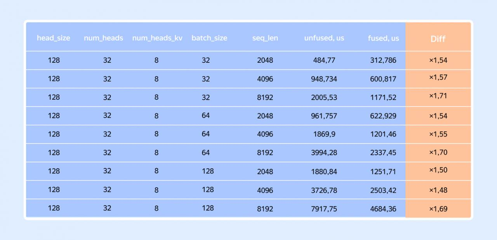

# Image Description

**File:** img_1773396728_aqadlrlrgutgul.jpg
**Original:** image.jpg
**Received:** 1773396728

## Extracted Text (OCR)

|     |    |     |       |          | 312,/86   |
|-----|----|-----|-------|----------|-----------|
| 128 |    |     | 4096, | 946, /34 | 600.81}   |
| 128 |    |     |       | 2095.53  | 1171.52   |
|     |    |     | зов   | 961,757  | 622,929   |
| 128 | 32 |     | 4096  | 1869,9   | 1201,46   |
| 138 |    |     | 319?  | 3994 28  | 2337.45   |
|     |    |     | 2048  | 1880 84  | 1251.71   |
| 128 | 32 | 128 |       | 3726,78  | 2503.42   |
| 128 |    | 128 | 8192  | 7917.75  |           |

## Usage Instructions

When referencing this image in markdown:
1. Use relative path based on file location
2. Add descriptive alt text based on OCR content above
3. Add text description BELOW the image for GitHub rendering

Example:
```markdown
 <!-- TODO: Broken image path -->

**Image shows:** [Describe what the image contains based on OCR]
```
