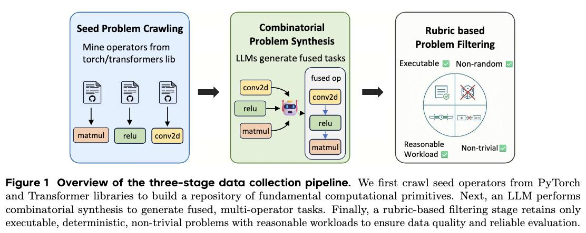

# Image Description

**File:** img_1773472182_aqadrhlrgz4giul_image_figure_1_overview.jpg
**Original:** image.jpg
**Received:** 1773472182

## Extracted Text (OCR)

<!-- image -->

Figure 1 Overview of the three-stage data collection pipeline. We first crawl seed operators trom PyTorch and 'lransformer libraries to build a repository of fundamental computational primitives. Next, an LLM performs combinatorial synthesis to generate fused, multi-operator tasks. Finally, a rubric-based filtering stage retains only executable, deterministic, non-trivial problems with reasonable workloads to ensure data quality and reliable evaluation.

## Usage Instructions

When referencing this image in markdown:
1. Use relative path based on file location
2. Add descriptive alt text based on OCR content above
3. Add text description BELOW the image for GitHub rendering

Example:
```markdown
 <!-- TODO: Broken image path -->

**Image shows:** [Describe what the image contains based on OCR]
```
