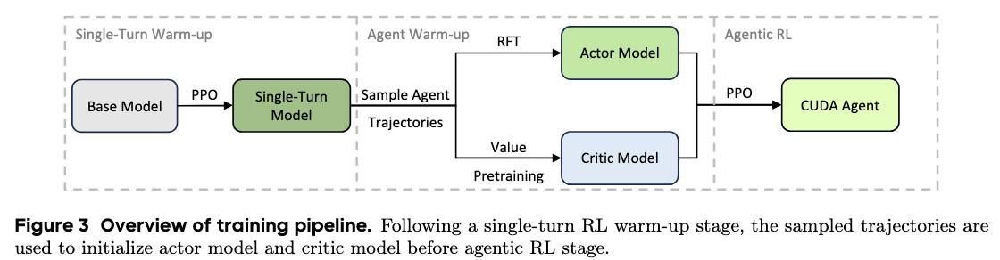

# Image Description

**File:** img_1773472182_aqadsblrgz4giul_image_figure_3_overview.jpg
**Original:** image.jpg
**Received:** 1773472182

## Extracted Text (OCR)

<!-- image -->

Figure 3 Overview of training pipeline. Following a single-turn RL warm-up stage, the sampled trajectories are used to initialize actor model and critic model before agentic RL stage.

## Usage Instructions

When referencing this image in markdown:
1. Use relative path based on file location
2. Add descriptive alt text based on OCR content above
3. Add text description BELOW the image for GitHub rendering

Example:
```markdown
 <!-- TODO: Broken image path -->

**Image shows:** [Describe what the image contains based on OCR]
```
