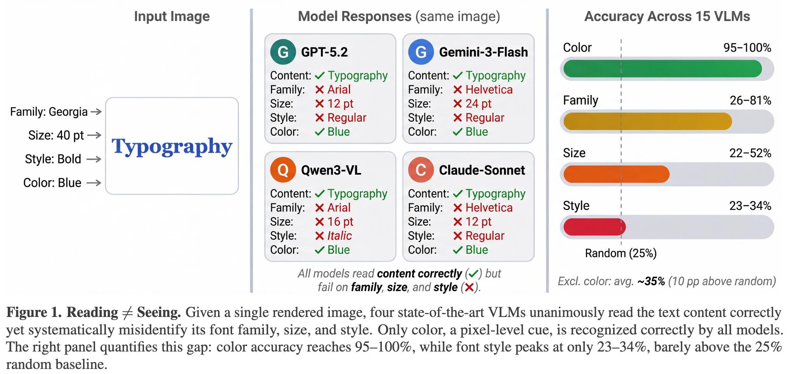

# Image Description

**File:** img_1773473585_aqadtxzrg9x7kul8_figure_1_reading_seeing_given.jpg
**Original:** image.jpg
**Received:** 1773473585

## Extracted Text (OCR)

Figure 1. Reading + Seeing. Given a single rendered image, four state-of-the-art VLMs unanimously read the text content correctly yet systematically misidentify its font family, size, and style. Only color, a p1xel-level cue, 1s recognized correctly by all models. The right panel quantifies this gap: color accuracy reaches 95—100%, while font style peaks at only 23-34%, barely above the 25% random haseline.

<!-- image -->

## Usage Instructions

When referencing this image in markdown:
1. Use relative path based on file location
2. Add descriptive alt text based on OCR content above
3. Add text description BELOW the image for GitHub rendering

Example:
```markdown
 <!-- TODO: Broken image path -->

**Image shows:** [Describe what the image contains based on OCR]
```
