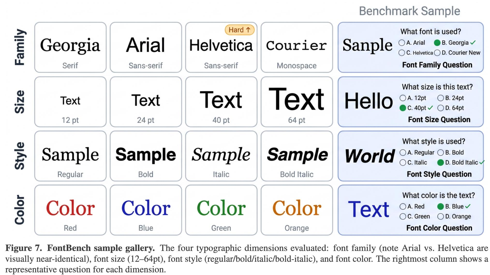

# Image Description

**File:** img_1773473585_aqadvbzrg9x7kul8_figure_7_fontbench_sample_gallery_the.jpg
**Original:** image.jpg
**Received:** 1773473585

## Extracted Text (OCR)

Figure 7. FontBench sample gallery. The four typographic dimensions evaluated: font family (note Arial vs. Helvetica are visually near-identical), font size (12—64pt), font style (regular/bold/italic/bold-italic), and font color. The rightmost column shows а representative question for each dimension.

<!-- image -->

## Usage Instructions

When referencing this image in markdown:
1. Use relative path based on file location
2. Add descriptive alt text based on OCR content above
3. Add text description BELOW the image for GitHub rendering

Example:
```markdown
 <!-- TODO: Broken image path -->

**Image shows:** [Describe what the image contains based on OCR]
```
