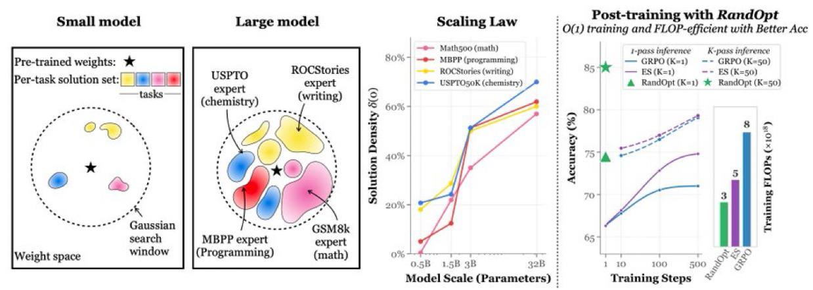

# Image Description

**File:** img_1773482741_aqadthvrg99gqul_image_image.jpg
**Original:** image.jpg
**Received:** 1773482741

## Extracted Text (OCR)

<!-- image -->

<!-- image -->

Pe aan : O(1) training and FLOP-efficient with Better Асс

| = Math soo (math) : Ppassinference == К.рахх inference

© ROCStories (writing) : 8S 7 — в =~ ES(K=50)

НО —— MBPP (programming) — GRPO(K=1) == GRPO(K=50)

—— eee ee s se № oe о oe fe \_ ob

—@— USPTOsoK (chemistry) “” + | A RandOpt (Кей № RandOpt (K=50)

tea ао

30

100

Model Scale (Parameters) : ‘Training Steps

<!-- image -->

<!-- image -->

## Usage Instructions

When referencing this image in markdown:
1. Use relative path based on file location
2. Add descriptive alt text based on OCR content above
3. Add text description BELOW the image for GitHub rendering

Example:
```markdown
 <!-- TODO: Broken image path -->

**Image shows:** [Describe what the image contains based on OCR]
```
