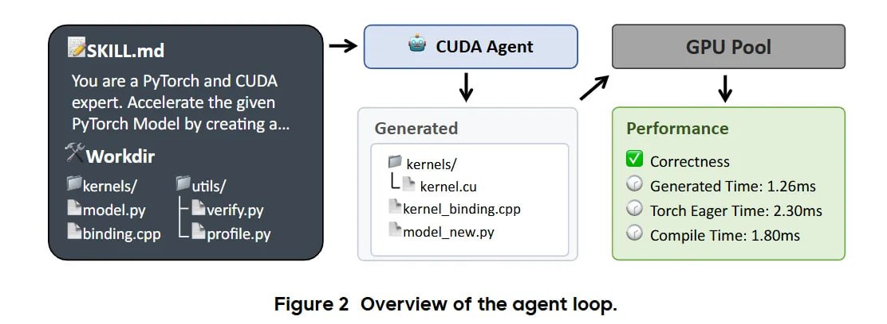

# Image Description

**File:** img_1773492255_aqadjxvrg16kqul_figure_2_overview_of_the_agent.jpg
**Original:** image.jpg
**Received:** 1773492255

## Extracted Text (OCR)

Figure 2 Overview of the agent loop.

<!-- image -->

## Usage Instructions

When referencing this image in markdown:
1. Use relative path based on file location
2. Add descriptive alt text based on OCR content above
3. Add text description BELOW the image for GitHub rendering

Example:
```markdown
 <!-- TODO: Broken image path -->

**Image shows:** [Describe what the image contains based on OCR]
```
