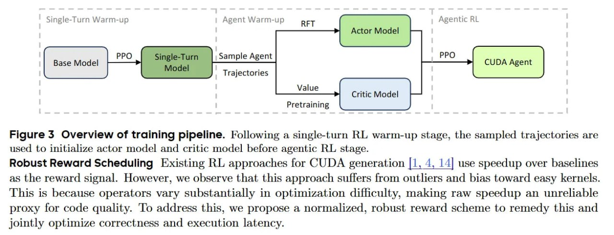

# Image Description

**File:** img_1773492255_aqadkbvrg16kqul_image_figure_5_overview.jpg
**Original:** image.jpg
**Received:** 1773492255

## Extracted Text (OCR)

<!-- image -->

Figure 5 Overview of training pipeline. Following a single-turn RL warm-up stage, the sampled trajectories are used to initialize actor model and critic model before agentic RL stage.

Robust Reward Scheduling Existing RL approaches for CUDA generation |1, 4, 14| use speedup over baselines as the reward signal. However, we observe that this approach suflers from outliers and bias toward easy kernels. This is because operators vary substantially in optimization difficulty, making raw speedup an unreliable proxy for code quality. To address this, we propose a normalized, robust reward scheme to remedy this and jointly optimize correctness and execution latency.

## Usage Instructions

When referencing this image in markdown:
1. Use relative path based on file location
2. Add descriptive alt text based on OCR content above
3. Add text description BELOW the image for GitHub rendering

Example:
```markdown
 <!-- TODO: Broken image path -->

**Image shows:** [Describe what the image contains based on OCR]
```
