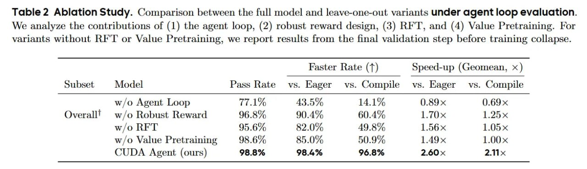

# Image Description

**File:** img_1773492255_aqadkhvrg16kqul_table_2_ablation_study_comparison_betwee.jpg
**Original:** image.jpg
**Received:** 1773492255

## Extracted Text (OCR)

Table 2 Ablation Study. Comparison between the full model and leave-one-out variants under agent loop evaluation. We analyze the contributions of (1) the agent loop, (2) robust reward design, (3) RFT, and (4) Value Pretraining. For variants without ВЕТ or Value Pretraining, we report results from the final validation step before training collapse.

|                                                          | Faster Rate (Т) Speed-up (Geomean, x )                             | Faster Rate (Т) Speed-up (Geomean, x )   |
|----------------------------------------------------------|--------------------------------------------------------------------|------------------------------------------|
|                                                          | Subset Model Pass Kate vs. Lager vs. Compile vs. Kager vs. Compile |                                          |
| w/o Agent Loop 77.1% 43.50 14.1 0.89x 0.69 x             |                                                                    |                                          |
| Overall! w/o Robust Reward 96.8% 90.4% 60.4% 1.70x 1.25% |                                                                    |                                          |
| w/o RET 95.6 82.0% 49.87% 1.56 x 1.05х                   |                                                                    |                                          |
| w/o Value Pretraining 98.6% 85.0% 50.9% 1.49 х 1.00х     |                                                                    |                                          |
| CUDA Agent (ours) 98.8% 98.4% 96.8% 2.60 x 2.11 x        |                                                                    |                                          |

## Usage Instructions

When referencing this image in markdown:
1. Use relative path based on file location
2. Add descriptive alt text based on OCR content above
3. Add text description BELOW the image for GitHub rendering

Example:
```markdown
 <!-- TODO: Broken image path -->

**Image shows:** [Describe what the image contains based on OCR]
```
