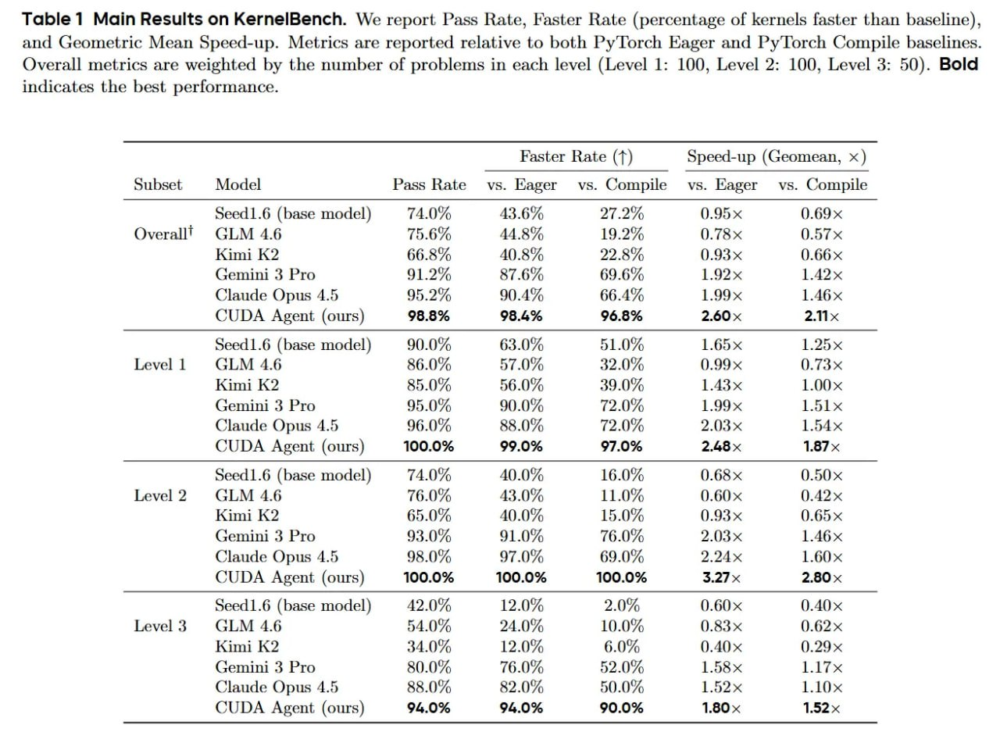

# Image Description

**File:** img_1773492255_aqadkrvrg16kqul_table_1_main_results_on_kernelbench.jpg
**Original:** image.jpg
**Received:** 1773492255

## Extracted Text (OCR)

Table 1 Main Results on KernelBench. We report Pass Rate, Faster Rate (percentage of kernels faster than baseline), and Geometric Mean Speed-up. Metrics are reported relative to both Py'Torch Eager and Py'Torch Compile baselines. Overall metrics are weighted by the number of problems in each level (Level 1: 100, Level 2: 100, Level 3: 50). Bold indicates the best performance.

|                                                      | Faster Rate (1) Speed-up (Geomean, x )                             | Faster Rate (1) Speed-up (Geomean, x )   |
|------------------------------------------------------|--------------------------------------------------------------------|------------------------------------------|
|                                                      | Subset Model Pass Rate vs. Eager vs. Compile vs. Eager vs. Compile |                                          |
| Seed 1.6 (base model) 74.0% 43.6% 27.2% 0.95 x 0.69х |                                                                    |                                          |
| Overall’ GLM 4.6 75.6% 44.8% 19.2% 0.78х 0.57x       |                                                                    |                                          |
| Kimi K? 66.8% 40.8% 99 8% 0.93 ~ 0.66                |                                                                    |                                          |
| (Jemini 3 Pro 01.2% 87 6 696% 192х 1.49              |                                                                    |                                          |
| Claude Opus 4.5 95.2% 90.4% 66.4% 1.99x 1.46x        |                                                                    |                                          |
| ДА Agent (ours) 98.8% 98.4% 96.8% 2.60 x 2.11 x      |                                                                    |                                          |
| Seed1.6 (base model) 90.0% 63.0% 51.0% 1.65х 1.25х   |                                                                    |                                          |
| Level 1 СЕМ 4.6 86.0% 57.0% 32.0% 0.99 0.73 x        |                                                                    |                                          |
| Kimi К? 85.0% 56.0% 39.0% 1.43x 1.00                 |                                                                    |                                          |
| (;emini 3 Pro  95.0%  90.0%  72 0%  1.99х  wo  1х    |                                                                    |                                          |
| Claude Opus 4.5 96.0% 88.0% 72.0% 2.03 x 1.54x       |                                                                    |                                          |
| CUDA Agent (ours) 100.0% 99.0% 97.0% 2.48 x 1.87 x   |                                                                    |                                          |
| Seed1.6 (base model) 74.0% 40.0% 16.0% 0.68 x 0.50   |                                                                    |                                          |
| Level? GLM 4.6 76.0% A838 0% 11.0% 0.60 0.49?        |                                                                    |                                          |
| Kimi К?  65.0% 40.0% 150% ().93х (0.65х              |                                                                    |                                          |
| (temini 3 Pro 93.0% 91.0% 76.0% 2 03x 1.46           |                                                                    |                                          |
| Claude Opus 4.5 98.0% 97.0% 69.0% 2.24 х 1.60 x      |                                                                    |                                          |
| CUDA Agent (ours) 100.0% 100.0% 100.0% 3.27 x 2.80 x |                                                                    |                                          |
| Seed1.6 (base model) 42.0% 12.0% 2.0% 0.60х (}.40х   |                                                                    |                                          |
| Level 3 GLM 4.6 54.0% 94 0% 10.0% 0.83 0.62          |                                                                    |                                          |
| Kimi К? 34.0'% 12.0% 6.0% 0.40х ().29х               |                                                                    |                                          |
| (temini 3 Pro 80.0% 76.0% 52.0% 158 1.17~x           |                                                                    |                                          |
| Claude Opus 4.5 88.0% 82.0% 50.0% 1.52х 1.10~x       |                                                                    |                                          |
| CUDA Agent (ours) 94.0% 94.0% 90.0% 1.80 x 1.52 x    |                                                                    |                                          |

## Usage Instructions

When referencing this image in markdown:
1. Use relative path based on file location
2. Add descriptive alt text based on OCR content above
3. Add text description BELOW the image for GitHub rendering

Example:
```markdown
 <!-- TODO: Broken image path -->

**Image shows:** [Describe what the image contains based on OCR]
```
