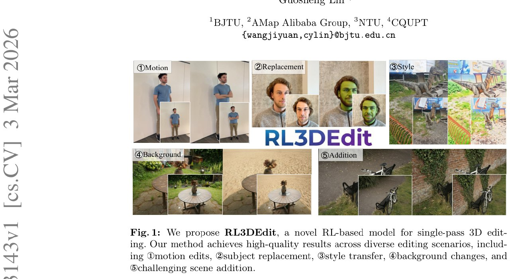

# Image Description

**File:** img_1773560650_aqadbxnrg3suiel_le_bjtu.jpg
**Original:** image.jpg
**Received:** 1773560650

## Extracted Text (OCR)

А ЗАК, Le ВАТ

*BJTU, “АМар Alibaba Group, "МТО, “CQUPT

{wang jiyuan,cylin}O@bjtu.edu.cn

Fig.1: We propose RL3DEdit, a novel RL-based model for single-pass 3D editing. Our method achieves high-quality results across diverse editing scenarios, including Dmotion edits, @subject replacement, @style transfer, ®background changes, and Schallenging scene addition.

<!-- image -->

## Usage Instructions

When referencing this image in markdown:
1. Use relative path based on file location
2. Add descriptive alt text based on OCR content above
3. Add text description BELOW the image for GitHub rendering

Example:
```markdown
 <!-- TODO: Broken image path -->

**Image shows:** [Describe what the image contains based on OCR]
```
