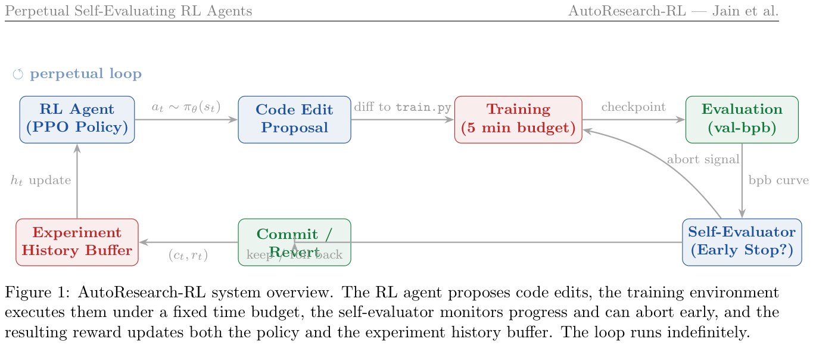

# Image Description

**File:** img_1773560755_aqadbrnrg3suiel8_figure_1_autoresearch_rl_system_overview.jpg
**Original:** image.jpg
**Received:** 1773560755

## Extracted Text (OCR)

Figure 1: AutoResearch-RL system overview. 'The RL agent proposes code edits, the training environment executes them under a fixed time budget, the self-evaluator monitors progress and can abort early, and the resulting reward updates both the policy and the experiment history buffer. 'The loop runs indefinitely.

<!-- image -->

## Usage Instructions

When referencing this image in markdown:
1. Use relative path based on file location
2. Add descriptive alt text based on OCR content above
3. Add text description BELOW the image for GitHub rendering

Example:
```markdown
 <!-- TODO: Broken image path -->

**Image shows:** [Describe what the image contains based on OCR]
```
