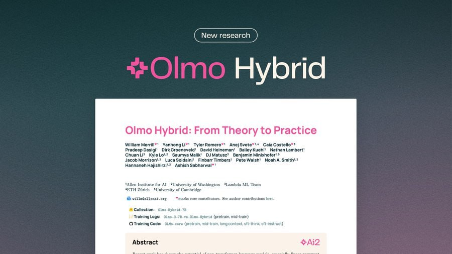

# Image Description

**File:** img_1773564322_aqadnxrrg2owul_new_research_hyboria.jpg
**Original:** image.jpg
**Received:** 1773564322

## Extracted Text (OCR)

( New research )

## Hyboria

## Oimo Hybrid: From Theory to Practice

Wiliam Meni"! Yanhonglin' Tytarkomeno"' Ane; ovete™'* Cala Costello™* Pradeep Dasigt' DirkGrogneveld' DavidHoineman BailoyKuehl' Nathan Lambo! Спа Ц Ку о? багу КАИ DJ Matusz' Benjamin Minixhoter® г Jacob Morrigen'=* Asnish Sabnearwal™ |

Traini Lox:

{у Training Code:

<!-- image -->

## Usage Instructions

When referencing this image in markdown:
1. Use relative path based on file location
2. Add descriptive alt text based on OCR content above
3. Add text description BELOW the image for GitHub rendering

Example:
```markdown
 <!-- TODO: Broken image path -->

**Image shows:** [Describe what the image contains based on OCR]
```
