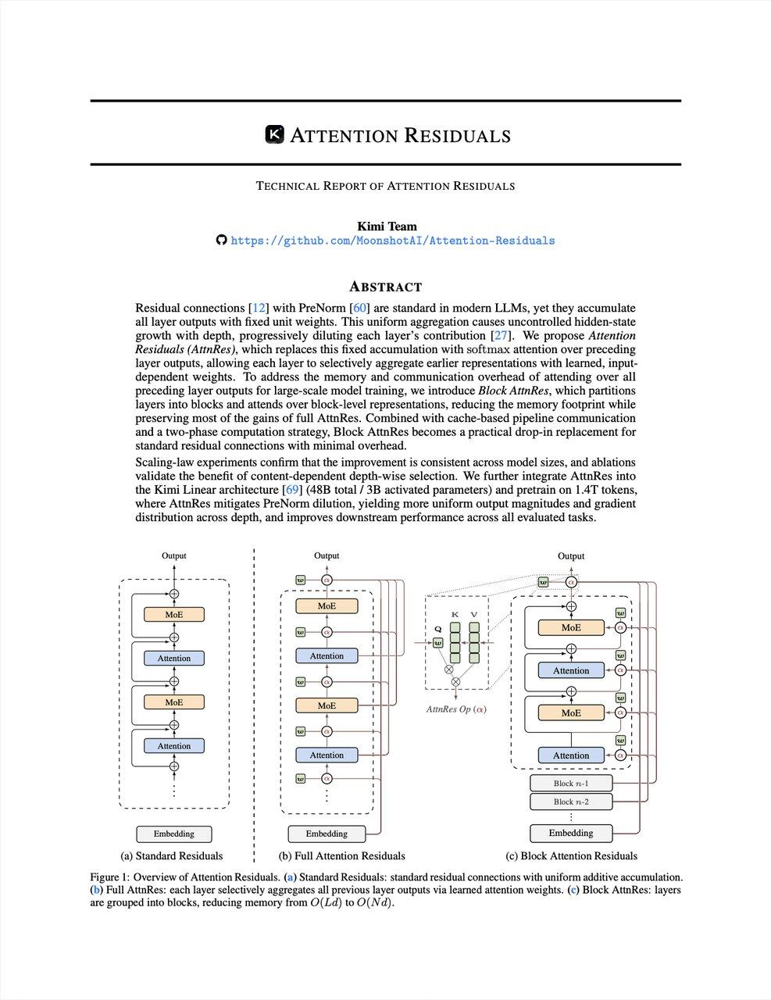

# Image Description

**File:** img_1773643860_aqadxrrrgxqlwel_image_technical_report.jpg
**Original:** image.jpg
**Received:** 1773643860

## Extracted Text (OCR)

<!-- image -->

## TECHNICAL REPORT OF ATTENTION RESIDUALS

## KIM

‘Team

<!-- image -->

СУ https: //¢ithub.com/MoonshotAl/Attention-Residuals

## ABSTRACT

Residual connections |! 2] with PreNorm [60] are standard in modern LLMs, yet they accumulate all layer outputs with fixed unit weights. This uniform aggregation causes uncontrolled hidden-state srowth with depth, progressively diluting each layer's contribution [27]. We propose Affention Residuals (AttnRes), which replaces this fixed accumulation with softmax attention over preceding layer outputs, allowing each layer to selectively aggregate earlier representations with learned, inputdependent weights. № address the memory and communication overhead of attending over all preceding layer outputs for large-scale model training, we introduce Siock Afinkes, which partitions layers into blocks and attends over block-level representations, reducing the memory footprint while preserving most of the gains of full AttnRes. Combined with cache-based pipeline communication and a two-phase computation strategy, Block AttnRes becomes a practical drop-in replacement for standard residual connections with minimal overhead.

Scaline-law experiments confirm that the improvement 1$ consistent across model sizes, and ablations validate the benefit of content-dependent depth-wise selection. We further integrate AttnRes into the Kimi Linear architecture [6] (46B total / 3B activated parameters) and pretrain on |.4T tokens, where AttnKes mitigates PreNorm dilution, yielding more uniform output magnitudes and gradient distribution across depth, and improves downstream performance across all evaluated tasks.

Figure 1: Overview of Attention Residuals. (a) Standard Residuals: standard residual connections with uniform additive accumulation. (fo) Pull AttnRes: each layer selectively aggregates all previous layer outputs via learned attention weights. (c) Block AttnRes: layers are grouped into blocks, reducing memory from © (Ld) to СИМ).

<!-- image -->

## Usage Instructions

When referencing this image in markdown:
1. Use relative path based on file location
2. Add descriptive alt text based on OCR content above
3. Add text description BELOW the image for GitHub rendering

Example:
```markdown
 <!-- TODO: Broken image path -->

**Image shows:** [Describe what the image contains based on OCR]
```
