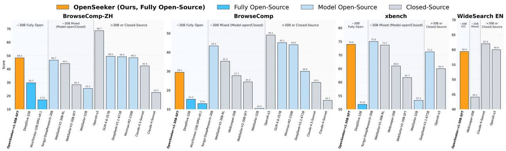

# Image Description

**File:** img_1773803714_aqad4xprgyp7yel_openseeker_ours_fully_open_source.jpg
**Original:** image.jpg
**Received:** 1773803714

## Extracted Text (OCR)

ШИВ OpenSeeker (Ours, Fully Open-Source) ШИ Fully Open-Source | Model Open-Source [| Closeda-Source

BrowseComp-2H BrowseComp xbench es WideSearch EN

' a0 . т ' “a i . ры 2—8 = -jo8: &gt;3 or
gate Fully Open | iMousiepencioned) | ay 7308 ог Closed-Source ~308 Fully Open | ~30B Mixed (Madel-open/Closed) | &gt;308 or Closed-Source go Fully Open | ЗОВ Mixed (Model-openiClosed) | cocoa. source HO | Mined | Closed-Souree

Ld
=

Baie

## Usage Instructions

When referencing this image in markdown:
1. Use relative path based on file location
2. Add descriptive alt text based on OCR content above
3. Add text description BELOW the image for GitHub rendering

Example:
```markdown
 <!-- TODO: Broken image path -->

**Image shows:** [Describe what the image contains based on OCR]
```
