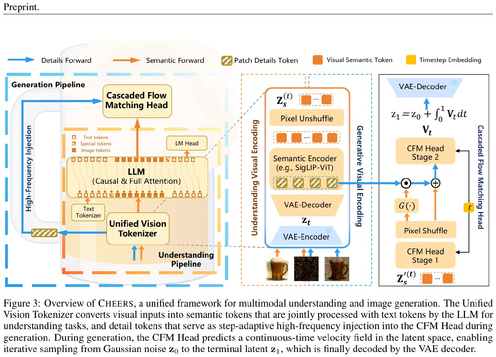

# Image Description

**File:** img_1773828245_aqadrbvrg4gpuel_figure_3_overview_of_cheers_a.jpg
**Original:** image.jpg
**Received:** 1773828245

## Extracted Text (OCR)

Figure 3: Overview of CHEERS, a unified framework for multimodal understanding and image generation. The Unified Vision Tokenizer converts visual inputs into semantic tokens that are jointly processed with text tokens by the LLM for understanding tasks, and detail tokens that serve as step-adaptive high-frequency injection into the CFM Head during generation. During generation, the CFM Head predicts a continuous-time velocity field in the latent space, enabling iterative sampling from Gaussian noise хо to the terminal latent 21, which is finally decoded Бу the VAE decoder.

<!-- image -->

## Usage Instructions

When referencing this image in markdown:
1. Use relative path based on file location
2. Add descriptive alt text based on OCR content above
3. Add text description BELOW the image for GitHub rendering

Example:
```markdown
 <!-- TODO: Broken image path -->

**Image shows:** [Describe what the image contains based on OCR]
```
