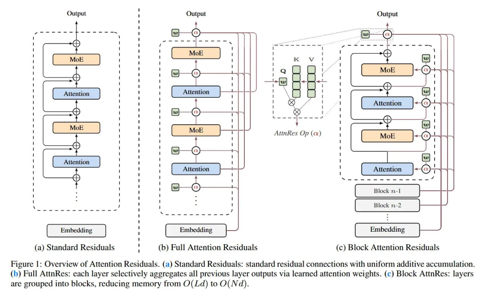

# Image Description

**File:** img_1773900672_aqad9bvrg0aadhjf_rigure_overview_of_attention_kesiduals.jpg
**Original:** image.jpg
**Received:** 1773900672

## Extracted Text (OCR)

rigure |: Overview of Attention Kesiduals. (a) Standard Kesiduals: standard residual connections with uniform additive accumulation. (b) Full AttnRes: each layer selectively aggregates all previous layer outputs via learned attention weights. (c) Block AttnRes: layers are grouped into blocks, reducing memory from O(Ld) to O( Nd).

<!-- image -->

## Usage Instructions

When referencing this image in markdown:
1. Use relative path based on file location
2. Add descriptive alt text based on OCR content above
3. Add text description BELOW the image for GitHub rendering

Example:
```markdown
 <!-- TODO: Broken image path -->

**Image shows:** [Describe what the image contains based on OCR]
```
