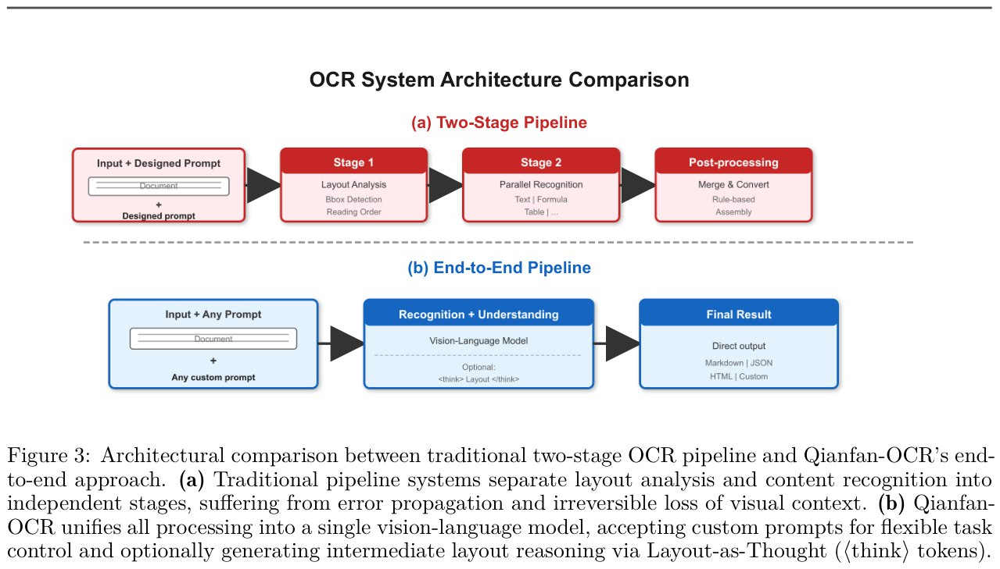

# Image Description

**File:** img_1773918904_aqadibdrg8mc2el_ocr_system_architecture_comparison.jpg
**Original:** image.jpg
**Received:** 1773918904

## Extracted Text (OCR)

## OCR System Architecture Comparison

<!-- image -->

Figure 3: Architectural comparison between traditional two-stage OCR pipeline and Qianfan-OCR's endto-end approach. (a) Traditional pipeline systems separate layout analysis and content recognition into independent stages, suffering from error propagation and irreversible loss of visual context. (b) QianfanOCR unifies all processing into a single vision-language model, accepting custom prompts for flexible task control and optionally generating intermediate layout reasoning via Layout-as-Thought ((think) tokens).

## Usage Instructions

When referencing this image in markdown:
1. Use relative path based on file location
2. Add descriptive alt text based on OCR content above
3. Add text description BELOW the image for GitHub rendering

Example:
```markdown
 <!-- TODO: Broken image path -->

**Image shows:** [Describe what the image contains based on OCR]
```
