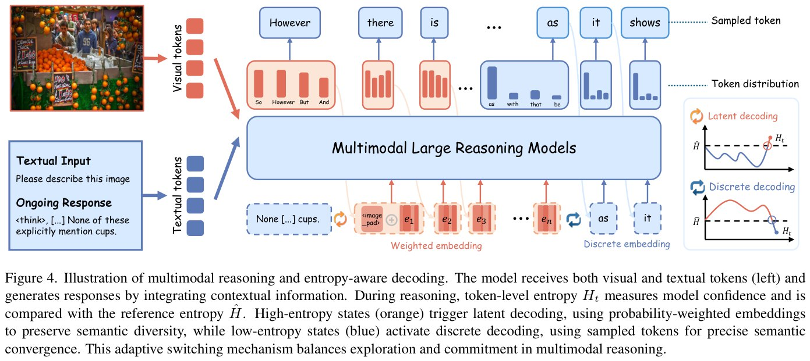

# Image Description

**File:** img_1773919005_aqadihdrg8mc2el8_figure_4_illustration_of_multimodal_reas.jpg
**Original:** image.jpg
**Received:** 1773919005

## Extracted Text (OCR)

Figure 4. Illustration of multimodal reasoning and entropy-aware decoding. The model receives both visual and textual tokens (left) and generates responses by integrating contextual information. During reasoning, token-level entropy НЫ, measures model confidence and Is compared with the reference entropy Н. High-entropy states (orange) trigger latent decoding, using probability-weighted embeddings to preserve semantic diversity, while low-entropy states (blue) activate discrete decoding, using sampled tokens for precise semantic convergence. [his adaptive switching mechanism balances exploration and commitment in multimodal reasoning.

<!-- image -->

## Usage Instructions

When referencing this image in markdown:
1. Use relative path based on file location
2. Add descriptive alt text based on OCR content above
3. Add text description BELOW the image for GitHub rendering

Example:
```markdown
 <!-- TODO: Broken image path -->

**Image shows:** [Describe what the image contains based on OCR]
```
