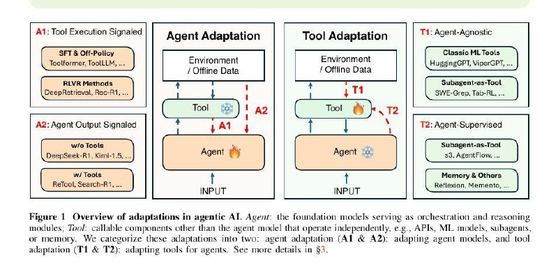
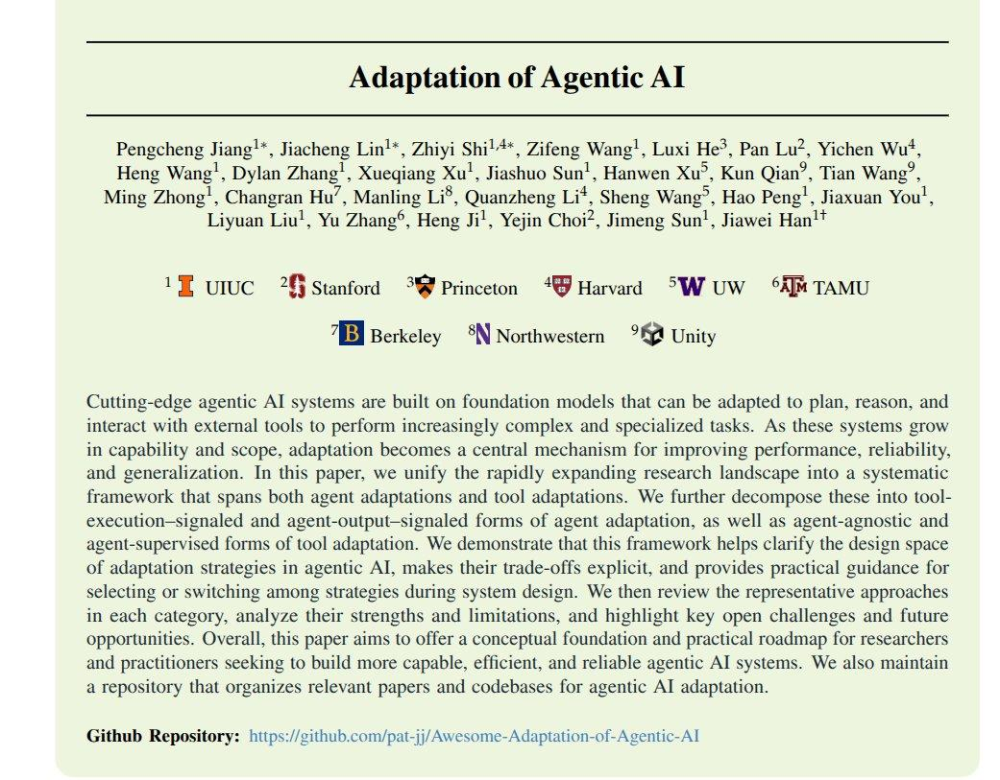
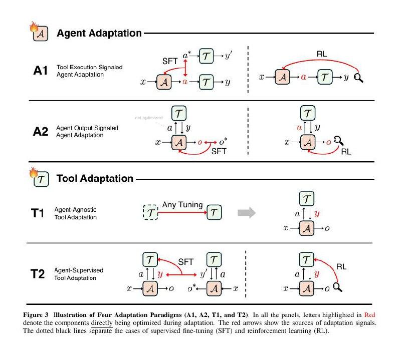
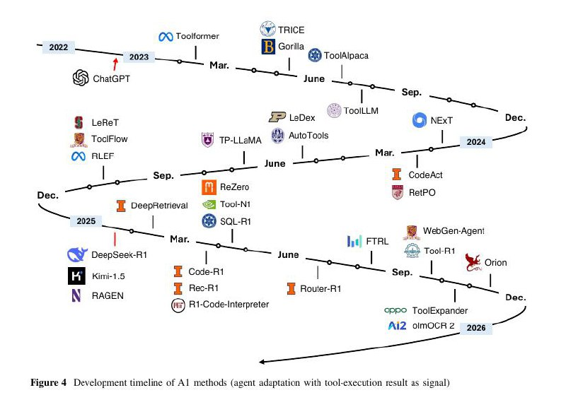
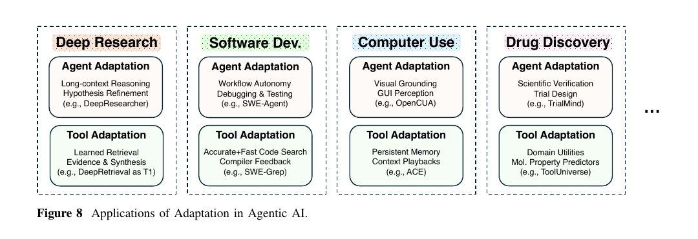

# Таксономия адаптации агентного ИИ (Agentic AI Adaptation Taxonomy)

**Рисунок 1. Обзор адаптаций в агентном ИИ.** Агент: основные модели, служащие модулями оркестровки и рассуждения; Инструменты: вызываемые компоненты, отличные от модели агента, которые работают независимо, например, API, модели ML, субагенты и инструменты или память. Мы классифицируем эти адаптации на две категории: адаптация агента (A1 & A2): адаптация модели агента; и адаптация инструментов (T1 & T2): адаптация инструментов для агентов.

## Введение

Фундаментальная 65-страничная работа от исследователей из Стэнфорда, Принстона, Гарварда, Вашингтонского университета и других топ-университетов впервые предлагает полную таксономию того, как современные агентные AI-системы адаптируются. 

**Рисунок. Адаптация агентного ИИ.** Современные агентные системы ИИ построены на фундаментальных моделях, которые можно адаптировать для планирования, рассуждения и взаимодействия с внешними инструментами для выполнения все более сложных и спеализированных задач. По мере роста их возможностей и охвата, адаптация становится центральным механизмом для улучшения производительности, надежности и обобщения. В этой статье мы объединяем быстро расширяющийся ландшафт исследований в систематическую структуру, охватывающую как адаптацию агентов, так и адаптацию инструментов. Мы далее разбиваем их на формы адаптации агента, сигнализируемые выполнением инструментов, и формы адаптации агента, сигнализируемые выводом агента, а также формы адаптации инструментов, независимые от агента и контролируемые агентом. Мы демонстрируем, что эта структура помогает прояснить пространство проектирования стратегий адаптации в агентном ИИ, делает их компромиссы явными и предоставляет практические рекомендации по выбору или переключению между стратегиями во время проектирования системы.

Главная идея: почти все сложные AI-агенты можно описать через всего 4 базовые типа адаптации - два связаны с обновлением самого агента, два других - с обновлением инструментов, которыми агент пользуется.

## Что такое агентный ИИ (Agentic AI)

Агентный ИИ — это большие модели, которые могут:
- вызывать инструменты
- использовать память
- выполнять задачи в несколько шагов

## Что такое адаптация

Адаптация — это любое изменение агента или его инструментов на основе обратной связи, от проверки кода до человеческих оценок.

## 4 вида адаптации

**Рисунок 2. Иллюстрация четырех парадигм адаптации (A1, A2, T1 и T2).** Во всех панелях буквы, выделенные красным, обозначают компоненты, непосредственно подвергающиеся оптимизации во время адаптации. Красные стрелки показывают источники адаптации. Пунктирные черные линии разделяют случаи тонкой настройки с учителем (SFT) и обучения с подкреплением (RL).

### A1 - Адаптация агента на основе выполнения инструментов (Agent Adaptation from Tool Execution)
Агент обновляется на основе того, что произошло при вызове инструментов: код запустился или упал, поиск что-то нашёл или нет.

**Рисунок 4. Развитие методов ИИ (адаптация агента с результатом выполнения инструмента как сигналом).** На этом графике показана эволюция методов A1 адаптации в хронологическом порядке, демонстрируя, как подходы к адаптации агентов на основе сигналов от выполнения инструментов развивались и усложнялись со временем.

**Примеры методов включают:**
- RL-based методы (Orion, olmOCR2, ToolExpander, WebGen-Agent, Tool-R1 и др.)
- SFT & DPO методы (LeReT, ToolFlow, TP-LLaMA и др.)

### A2 — Адаптация агента на основе оценки вывода (Agent Adaptation from Output Evaluation)  
Агент обновляется по оценкам качества своих итоговых действий: человеческим фидбеком, автопроверками ответов, качеством планов.

**Примеры методов включают:**
- Методы с инструментами (TT-SI, A²FM, MedResearcher-R1 и др.)
- Методы без инструментов (Empower, KnowRL, GRACE и др.)

### T1 - Адаптация инструментов независимо от агента (Tool Adaptation Independent of Agent)
Инструменты обучаются отдельно, а агент остаётся "замороженным". Например, заранее тренированный retriever или кодовый поисковик.

**Примеры включают:**
- Фундаментальные системы и архитектуры (Neural Operators, HuggingGPT, ViperGPT, SciToolAgent)
- Методы обучения (CLIP, SAM, Whisper и др.)

### T2 - Адаптация инструментов на основе сигналов от агента (Tool Adaptation from Agent Signals)
Агент остаётся фиксированным, но инструменты подстраиваются под его поведение — какие документы действительно помогли, какие подсказки улучшили выполнение задачи.

**Примеры методов включают:**
- QAgent, AgentFlow, Advisor Models, AutoGraph-R1, MAE и др.

## Почему это важно

- **Систематизация**: Работа впервые системно упорядочивает методики адаптации агентных систем.
- **Компромиссы**: Помогает понять компромиссы между стоимостью обучения, гибкостью, переносимостью и модульными обновлениями.
- **История развития**: Показывает историю развития методов A1, A2 и T2, как они усложнялись и какие сигналы начали использовать.

**Рисунок. Применения адаптации в агентном ИИ.** На этом изображении представлены различные области применения адаптационных методов в системах агентного ИИ, включая адаптацию к новым инструментам, адаптацию поведения агента и адаптацию к пользовательским предпочтениям.

## Основные оси таксономии

Взгляд сводится к двум осям:
- **Можно менять агента** (A1 и A2)
- **Можно менять инструменты** (T1 и T2)
- Данные и фидбек служат топливом для обеих стратегий.

## Значение таксономии

Эта таксономия помогает:
- Увидеть связи между десятками современных работ
- Понять, куда движутся агентные архитектуры нового поколения
- Понять компромиссы между различными подходами
- Структурировать будущие исследования в области адаптации агентов

## Связи с другими темами

- [[../agentic_rag.md]] - агентные RAG-системы
- [[../memory_systems_for_ai_agents.md]] - системы памяти для ИИ-агентов
- [[../../optimization/parameter_efficient_training.md]] - параметрически эффективное обучение, важное для A1 адаптации
- [[../../llm/lora_optimization.md]] - Low-Rank Adaptation, часто используемый метод для адаптации

## Источники

1. [Adaptation of Agentic AI - Research Paper from Stanford, Princeton, Harvard](https://github.com/pat-jj/Awesome-Adaptation-of-Agentic-AI) - основная статья, описывающая 4-уровневую таксономию адаптации агентного ИИ
2. Таксономия адаптации агентного ИИ: A1 - Адаптация агента от выполнения инструментов, A2 - Адаптация агента от оценки вывода, T1 - Адаптация инструментов независимо от агента, T2 - Адаптация инструментов от сигналов агента

## Дополнительные материалы

- [Awesome-Adaptation-of-Agentic-AI GitHub Repository](https://github.com/pat-jj/Awesome-Adaptation-of-Agentic-AI) - кураторский список статей о стратегиях адаптации систем агентного ИИ