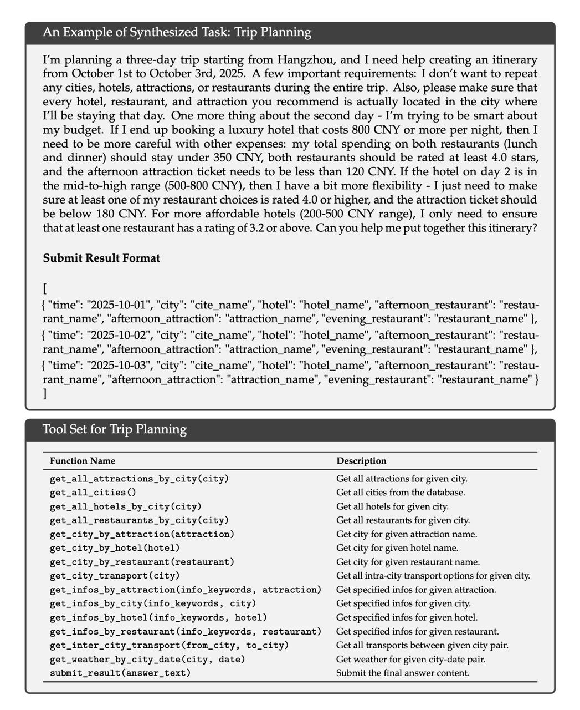
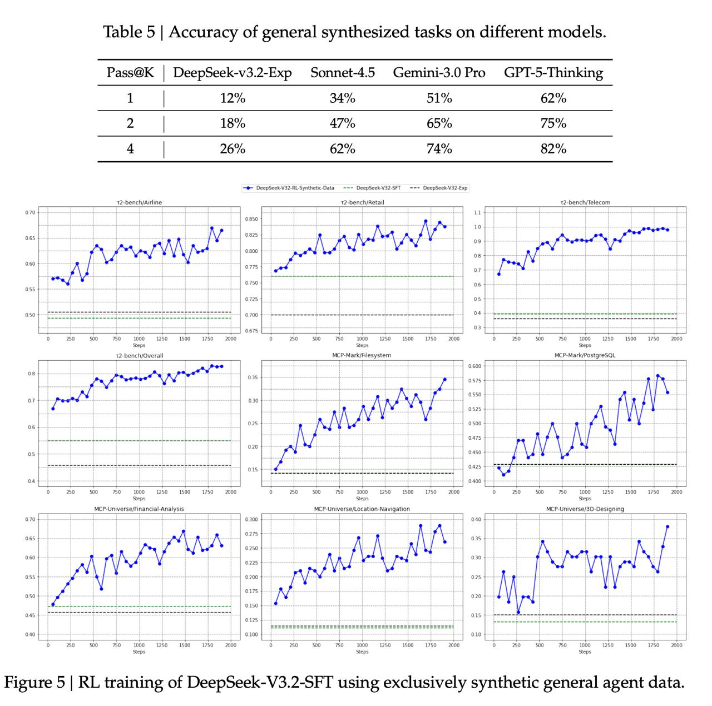

# Методы подготовки агентных систем с использованием синтетических данных

## Общее описание

Подготовка агентных систем с использованием синтетических данных - это передовой подход в области искусственного интеллекта, при котором агенты обучаются на искусственно созданных обучающих примерах. Эти данные генерируются с помощью алгоритмических методов или других моделей, а не собраны из реальных человеческих взаимодействий. Подход широко используется в современных LLM, включая DeepSeek V3.2, для подготовки универсальных агентов в четырех категориях: Поисковый агент, Кодинг-агент, Общий агент и Кодовый интерпретатор.

## Контекст и мотивация

### Проблема данных для агентного обучения

Создание качественных обучающих данных для агентных систем часто требует значительных ресурсов и времени. Синтетические данные предлагают способ расширить и улучшить обучающие наборы, особенно в областях, где реальные данные ограничены, дороги или недоступны из-за конфиденциальности или сложности сбора.

### Масштабирование агентных задач

DeepSeek собрали и синтезировали 85 тысяч агентных задач в 4 категориях, используя специализированные агенты для генерации обучающих данных. Это позволяет подготовить модели к широкому спектру задач, которые они могут встретить в реальном использовании.

## Методы генерации синтетических данных для агентов

### Мультиагентная система

В DeepSeek используется мультиагентная система на базе DeepSeek-V3.2 для генерации разнообразных и высококачественных обучающих данных:
- Несколько разных агентов с разными чекпоинтами моделей
- Разные системные промпты
- Разные конфигурации инструментов (поиск вглубь/вширь)
- Взаимное обучение и верификация результатов

### Агент-генератор вопросов

- Вычленяют сущности из "длинного хвоста" в различных доменах
- Используют интернет-корпуса, хранящие сотни тысяч интернет-страниц
- Исследуют каждую сущность, используя инструмент поиска
- Консолидируют найденную информацию в пары вопрос-ответ

### Агент-верификатор

- Проверяет все ответы в несколько проходов
- Оставляет только те образцы, где ответ достоверен
- Обеспечивает качество синтетических данных перед обучением
- Использует автоматические и рубричные проверки

## Категории агентных задач

### Поисковый агент (Search Agent)

#### Архитектура
- Мультиагентная система на базе DeepSeek-V3.2
- Интеграция с веб-поиском и индексами
- Система верификации информации

#### Процесс генерации
1. Вычленение сущностей из веб-корпусов
2. Генерация вопросов для каждой сущности
3. Поиск и консолидация информации
4. Создание вопрос-ответных пар
5. Многократная верификация

#### Особенности
- Охватывает множество языков, доменов и уровней сложности
- Генерирует рубрики для оценки ответов
- Использует разные стратегии поиска (вглубь/вширь)

### Кодинг-агент (Code Agent)

#### Источник данных
- Извлечение миллионов пар "issue — Pull Request (PR)" из GitHub
- Использование реальных проблем и решений из open source

#### Фильтрация и качество
- Тщательная фильтрация с использованием эвристик
- Использование запромпченных LLM для проверки качества
- Требования к описанию проблемы, "золотому патчу" и тестам

#### Автоматизация среды
- Использование агента на базе DeepSeek-V3.2 для настройки среды
- Установка пакетов и разрешение зависимостей
- Прогон тестов для проверки корректности

#### Проверка сред
- Только те среды, где "золотой" патч увеличивает количество проходящих тестов
- Без падения тестов, которые проходили до применения патча
- Охват нескольких языков программирования

### Общий агент (General Agent)

#### Многоступенчатый процесс
1. Сбор большого набора категорий задач
2. Генерация данных с использованием инструментов
3. Создание специфичных инструментов как функций
4. Итеративное усложнение задач

#### Создание задач
- Сначала предлагает простую задачу на основе базы данных
- Создает решение и функции проверки на Python
- Если решение не проходит, модифицирует решение или функции
- Итеративно увеличивает сложность задачи

#### Самодополнение инструментов
- При необходимости добавляет новые инструменты
- Использует виртуальную машину с инструментами CLI и поиска
- Создает инструменты как функции Python

### Кодовый интерпретатор (Code Interpreter Agent)

Категория, о которой в исходном источнике не было подробной информации, но упомянута как отдельная категория агентных задач.

## Техники обеспечения качества синтетических данных

### RL-фильтрация

Для категории General Agent делают дополнительную фильтрацию:
- Запускают RL на синтетическом наборе данных
- Прогоняют промежуточную модель по 100 раз на каждом вопросе
- Оставляют только те, где модель хотя бы раз смогла дать правильный ответ

### Сравнение с проприетарными моделями

Чтобы проверить качество, авторы случайным образом выбирают 50 примеров и оценивают разные модели:
- DeepSeek-V3.2-Exp достигает точности всего 12% с первой попытки
- Ведущие закрытые модели достигают 62%
- Это показывает потенциал синтетических данных для обучения

### Проверка на других бенчмарках

- Показан рост метрик в разных бенчмарках при обучении только на синтетике
- Это подтверждает эффективность использования синтетических данных

 <!-- TODO: Broken image path -->

**Изображение показывает:** Пример синтезированной задачи для General Agent по планированию трехдневной поездки из Ханчжоу с 1 по 3 октября 2025 года. Задача включает в себя выбор городов, отелей, достопримечательностей и ресторанов без повторений, с учетом бюджетных ограничений и требований к рейтингам. Также показан формат результата и набор инструментов, доступных для решения задачи.

 <!-- TODO: Broken image path -->

**Таблица 5 показывает:** Точность решения общих синтезированных задач на разных моделях. DeepSeek-V3.2-Exp достигает точности всего 12% с первой попытки, в то время как передовые закрытые модели (Sonnet-4.5, Gemini-3.0 Pro, GPT-5-Thinking) достигают 34%, 51% и 62% соответственно. Это демонстрирует разрыв в способности к решению синтезированных задач между открытыми и закрытыми моделями.

## Технические особенности

### Thinking Retention Mechanism

- Используется подход, при котором рассуждения не выкидываются
- Модель видит свои рассуждения при генерации следующего вызова инструмента
- Это позволяет более эффективно использовать токены и сохранять контекст

### Масштабирование вычислений

- Генерация 32 или 500 кандидатов для программистских задач
- Фильтрация по тестам
- Несколько отправок решений, к которым привели самые длинные цепочки рассуждений

## Преимущества подхода

### Масштабируемость

- Возможность генерации большого объема данных
- Быстрое создание данных для новых задач
- Минимальные затраты на человеческие ресурсы

### Контроль качества

- Возможность генерации данных с известными свойствами
- Возможность создания сбалансированного набора данных
- Контроль сложности и разнообразия

### Специфичность для задачи

- Создание данных, идеально подходящих для целевой задачи
- Возможность тонкой настройки характеристик данных
- Адаптация под специфические форматы и требования

## Ограничения и риски

### Качество данных

- Возможность генерации ошибочных или вводящих в заблуждение примеров
- Склонность к распространению предубеждений исходной модели
- Необходимость проверки и фильтрации (как в RL-фильтрации)

### Self-Reinforcement (Самоукрепление)

- Риск усиления существующих ошибок или предубеждений
- Отклонение от желаемого целевого распределения
- Устойчивость к корректировке ошибок

### Недостаток разнообразия

- Ограничение разнообразия по сравнению с реальными данными
- Склонность к повторению шаблонов исходной модели
- Отсутствие неожиданных ситуаций из реального мира

## Применения

### Подготовка универсальных агентов

- Модели, способные к вызову инструментов
- Многоступенчатые задачи с использованием внешних API
- Комплексные задачи, требующие планирования и рассуждений

### Улучшение специализированных способностей

- Математические задачи
- Программирование
- Логические рассуждения
- Поисковые задачи

## Сравнение с альтернативными методами

### Традиционное обучение на человеческих данных

- Высокое качество, но ограничения в масштабе
- Значительные затраты на сбор и аннотацию
- Меньшая гибкость в адаптации

### Синтетические данные без верификации

- Более высокий риск низкокачественных данных
- Меньшая надежность итоговой модели
- Без гарантий корректности

### Подход DeepSeek

- Высокое качество за счет многоступенчатой верификации
- Широкое покрытие за счет агентной генерации
- Масштабируемость за счет автоматизации

## Будущие направления

### Автоматизированные валидаторы

- Разработка более надежных методов проверки синтетических данных
- Использование формальных методов для верифицируемых задач
- Интеграция с системами автоматического доказательства

### Самоулучшение систем

- Циклы, где модели улучшают собственные синтетические данные
- Использование RL для оптимизации качества синтетических примеров
- Автоматическое обнаружение и исправление ошибок

## Эффективность и результаты

### Достижения DeepSeek V3.2

- 5/6 задач с международной олимпиады по математике (золото)
- Золото на ICPC/IOI (серьезные соревнования по программированию)
- Высокая эффективность в задачах рассуждений и вызова инструментов

### Ограничения

- Широта знаний о мире еще отстает от ведущих проприетарных моделей
- Для Speciale-версии требуется в 2-3 раза больше токенов из-за длинных цепочек рассуждений

## Связи с другими темами

- [[deepseek_v3_2_reinforcement_learning_agent_training.md]] - подробности о подходе в DeepSeek V3.2
- [[ai/llm/synthetic_training_data.md]] - синтетические обучающие данные для LLM
- [[ai/agents/advanced_tool_calling_and_planning.md]] - продвинутое вызывание инструментов и планирование
- [[thinking_retention_mechanism.md]] - механизм сохранения мышления
- [[generative_reward_model_grm.md]] - генеративные модели вознаграждения
- [[swe_bench.md]] - бенчмарк для задач программирования

## Связи с другими темами

- [[deepseek_v3_2_reinforcement_learning_agent_training.md]] - подробности о подходе в DeepSeek V3.2
- [[ai/llm/synthetic_training_data.md]] - синтетические обучающие данные для LLM
- [[ai/agents/advanced_tool_calling_and_planning.md]] - продвинутое вызывание инструментов и планирование
- [[thinking_retention_mechanism.md]] - механизм сохранения мышления
- [[generative_reward_model_grm.md]] - генеративные модели вознаграждения
- [[swe_bench.md]] - бенчмарк для задач программирования
- [[off_policy_sequence_masking.md]] - метод стабилизации агентного обучения
- [[ai/llm/models/deepseek_sparse_attention.md]] - технология, используемая в агентных моделях

## Источники

- Технический отчет: https://huggingface.co/deepseek-ai/DeepSeek-V3.2
- Статья о DeepSeek V3.2: "DeepSeek-V3.2: Pushing the Frontier of Open Large Language Models"
- Данные о бенчмарках и сравнениях с другими моделями
- Исследования по агентным системам и синтетическим данным