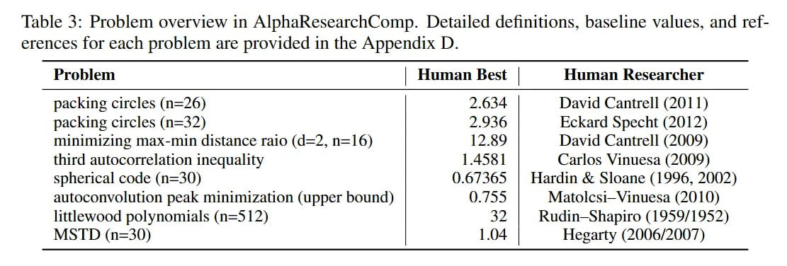

# AlphaResearchComp: Бенчмарк для оценки систем автоматического открытия алгоритмов

## Общее описание

AlphaResearchComp - это новый открытый бенчмарк, состоящий из 8 сложных алгоритмических задач, созданный авторами AlphaResearch для обеспечения прозрачной и воспроизводимой оценки систем автоматического открытия алгоритмов. Бенчмарк включает задачи из различных областей: геометрии, теории чисел и оптимизации.

**Описание:** Структура бенчмарка AlphaResearchComp, показывающая разнообразие задач из геометрии, теории чисел и оптимизации.

## Структура бенчмарка

### Задачи включенные в AlphaResearchComp:

1. **Задача упаковки кругов (Circle Packing)** - упаковка n непересекающихся кругов в единичный квадрат с максимизацией суммы радиусов
2. **Многочлены Литтлвуда (Littlewood Polynomials)** - задача, связанная с теорией чисел и комплексным анализом
3. Другие задачи из геометрии, теории чисел и оптимизации (точные формулировки требуют дополнительного описания)

## Метрики оценки

### Метрика excel @---

Авторы AlphaResearch предложили метрику excel @--- для измерения производительности систем. Эта метрика:

- Количественно оценивает процент улучшения по сравнению с лучшим известным решением человека
- Учитывает, является ли для конкретной задачи желательным более высокий или более низкий балл
- Позволяет объективно сравнивать результаты разных систем

## Результаты AlphaResearch на бенчмарке

- AlphaResearch достиг "доли побед" 2/8 против экспертов-людей
- Наиболее впечатляющий результат - в задаче упаковки кругов, где система открыла новый лучший известный алгоритм
- В 6 из 8 задач система показала результаты хуже экспертов-людей, что подчеркивает сложность автоматизированного научного открытия

### Важные аспекты тестирования

Авторы тестировали систему в разных условиях:

1. **Начиная с нуля** - без предварительных знаний
2. **С умеренной инициализацией** - с базовыми начальными решениями
3. **Стартуя с лучшего известного человеческого решения** - в этом случае для некоторых задач (например, многочлены Литтлвуда) не было найдено никаких улучшений

## Значение бенчмарка

### Для сообщества исследований

- **Прозрачность и воспроизводимость** - предоставляет стандартный набор задач для оценки систем
- **Объективное сравнение** - позволяет сравнивать производительность разных подходов
- **Стимулирование прогресса** - создает четкие направления для улучшения систем

### Для оценки систем автоматического открытия

- **Разнообразие задач** - охватывает разные области математики и оптимизации
- **Реалистичные вызовы** - включает сложные задачи, которые являются открытыми проблемами
- **Научная значимость** - задачи имеют реальную математическую и практическую ценность

## Сравнение с другими бенчмаркми

В отличие от более общих бенчмарков для агентов, AlphaResearchComp специфически ориентирован на:

- **Алгоритмическое открытие** - фокус на создание новых алгоритмов, а не просто на решение задач
- **Научную новизну** - оценка не только эффективности, но и инновационности решений
- **Математическую строгость** - задачи требуют строгой математической формулировки и проверки

## Связи с другими темами

- [[ai/agents/alpharesearch_system.md]] - основная система, протестированная на этом бенчмарке
- [[ai/agents/challenging_benchmarks_for_agents.md]] - контекст других бенчмарков для агентов
- [[ai/agents/ai_agent_benchmarks.md]] - общая информация о бенчмарках для агентов ИИ
- [[ai/optimization/circle_packing_alpharesearch.md]] - подробности о задаче упаковки кругов из бенчмарка
- [[ai/optimization/mathematical_optimization_problems.md]] - математические задачи, лежащие в основе бенчмарка
- [[ai/number_theory/littlewood_polynomials.md]] - задача многочленов Литтлвуда из бенчмарка (требует создания отдельного файла)

## Источники

1. [AlphaResearch: Accelerating New Algorithm Discovery with Language Models](https://arxiv.org/abs/2511.08522) - основная статья, описывающая бенчмарк AlphaResearchComp и его результаты
2. [AlphaResearch GitHub Repository](https://github.com/answers111/alpha-research) - исходный код бенчмарка и тестовые задачи