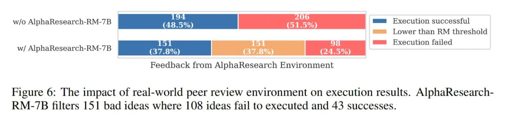

# AlphaResearch: Система для ускорения открытия новых алгоритмов с помощью языковых моделей

## Общее описание

AlphaResearch - это автономный исследовательский агент, разработанный для открытия новых алгоритмов для решения задач с открытым результатом. Система представляет собой развитие подхода, применяемого в AlphaEvolve, но включает ключевую инновацию - "двойную исследовательскую среду", которая расширяет подход верификации на основе выполнения кода, добавляя симулированный механизм рецензирования (peer review) на основе модели вознаграждения.

**Описание:** Схема архитектуры системы AlphaResearch, показывающая двойную исследовательскую среду с верификацией на основе выполнения кода и симулированным рецензированием.

## Архитектура и подход

AlphaResearch использует двойную исследовательскую среду, состоящую из двух ключевых механизмов:

1. **Верификация на основе выполнения кода**: как и в предыдущих системах (например, AlphaEvolve), агент генерирует код, который затем выполняется и оценивается по объективным метрикам производительности. Это гарантирует, что любое предложенное решение является рабочим и корректным.

2. **Симулированное рецензирование**: ключевое отличие AlphaResearch от предыдущих систем. Прежде чем переходить к генерации и выполнению кода, новая исследовательская идея сначала оценивается моделью вознаграждения (AlphaResearch-RM-7B). Эта модель обучена на более чем 24,000 реальных рецензиях с конференции ICLR (2017–2024) и присваивает оценку, отражающую новизну, строгость и потенциальное влияние идеи, фактически симулируя суждения рецензентов-людей.

## Ключевые инновации

### Двойная исследовательская среда

Центральный вклад AlphaResearch - это новая двойная исследовательская среда, разработанная для преодоления "разрыва между идеей и её выполнением". Этот разрыв отражает фундаментальное противоречие: системы, отдающие приоритет новым идеям, часто производят концепции, которые вычислительно невыполнимы, в то время как системы, сфокусированные исключительно на выполнении, могут сходиться к решениям, которые технически корректны, но научно тривиальны.

AlphaResearch решает эту проблему, сочетая качество идеи с производительностью её выполнения, что позволяет отсеивать бесперспективные направления на раннем этапе и экономить значительные вычислительные ресурсы.

### Модель вознаграждения AlphaResearch-RM-7B

Модель вознаграждения AlphaResearch-RM-7B - это файнтюн Qwen-2.5-7B-Instruct, обученная на 24,445 реальных рецензиях с конференции ICLR (2017–2024). Она действует как фильтр, отбирая идеи, которые с высокой вероятностью будут иметь научную ценность. В тестах на классификации качества статей для ICLR 2025 модель достигла 72% точности, значительно превзойдя GPT-5 (medium) (53%) и людей-аннаторов (65%).

## Экспериментальные результаты

Для тестирования системы авторы создали AlphaResearchComp - новый бенчмарк из восьми открытых задач из геометрии, теории чисел и оптимизации. AlphaResearch достиг "доли побед" 2/8 против экспертов-людей.

**Описание:** Графическое представление результатов AlphaResearch на бенчмарке AlphaResearchComp, показывающее сравнение с экспертом-человеком и другими подходами.

### Задача упаковки кругов

Самый яркий успех был достигнут в задаче "упаковки кругов", где требуется упаковать n непересекающихся кругов в единичный квадрат, максимизируя сумму их радиусов. Для n=32 AlphaResearch открыл алгоритм, который достиг результата 2.939, превзойдя лучшее известное человеческое решение (2.936) и предыдущий SOTA от AlphaEvolve (2.937).

### Эффективность симулированного рецензирования

Механизм симулированного рецензирования оказался эффективным на практике. Фильтр корректно отклонил 108 идей для задачи упаковки кругов, которые в конечном итоге не прошли бы проверку выполнением.

**Описание:** Графическое представление эффективности механизма фильтрации идей в AlphaResearch, показывающее экономию вычислительных ресурсов.

## Ограничения

Несмотря на прорыв в задаче упаковки кругов, AlphaResearch показал результаты хуже экспертов-людей в 6 из 8 задач бенчмарка. Важно, что авторы тестировали агента в разных условиях: начиная с нуля, с умеренной инициализацией или даже стартуя с лучшего известного человеческого решения. В последнем случае, для задач вроде "многочлены Литтлвуда", агент не смог найти никаких улучшений, что подчёркивает сложность превзойти оптимизированную человеческую изобретательность.

## Влияние и значение

AlphaResearch представляет собой значительный шаг в развитии автономных агентов для совершения открытий:

- **Новый подход к оценке идей**: интеграция симулированного процесса рецензирования направляет поиск новых алгоритмов не просто на то, что работает, а на то, что имеет научную ценность
- **Прорыв в классической задаче**: открытие нового лучшего из известных решений для задачи упаковки кругов - мощное доказательство концепции
- **Гибридный подход**: система предполагает, что будущее ИИ-учёных - за гибридными системами, которые сочетают чистую мощь оптимизации на основе выполнения кода с пониманием того, что представляет собой хорошая идея
- **Открытый исходный код**: вклад в область в виде open-source бенчмарка и кода

## Сравнение с AlphaEvolve

- **Дополнительная оценка**: в отличие от AlphaEvolve, AlphaResearch добавляет предварительную оценку идей с помощью модели вознаграждения
- **Фильтрация идей**: AlphaResearch отсеивает бесперспективные идеи до этапа реализации, в то время как AlphaEvolve оценивает только выполненные решения
- **Симулированное рецензирование**: AlphaResearch имитирует научный процесс рецензирования, чего нет в AlphaEvolve
- **Улучшенная направленность**: AlphaResearch более направлен на научно ценные открытия, а не просто на работающий код

**Описание:** Визуализация сравнения между подходами AlphaEvolve и AlphaResearch, демонстрирующая преимущества двойной исследовательской среды.

## Связи с другими темами

- [[ai/agents/alphaevolve_system.md]] - предшественник AlphaResearch, использовавший только верификацию на основе выполнения
- [[ai/agents/alpharesearch_benchmark.md]] - бенчмарк AlphaResearchComp для оценки систем автоматического открытия
- [[ai/optimization/circle_packing_alpharesearch.md]] - подробности о прорыве в задаче упаковки кругов
- [[ai/llm/models/alpharesearch_reward_model.md]] - модель вознаграждения AlphaResearch-RM
- [[ai/agents/simulated_peer_review_in_ai_research.md]] - концепция симулированного рецензирования в ИИ-исследованиях
- [[ai/optimization/packing_problems.md]] - контекст задач упаковки, решаемых AlphaResearch
- [[ai/llm/rlhf.md]] - методы обучения с подкреплением через человеческую обратную связь, на которых основаны модели вознаграждения

## Источники

1. [AlphaResearch: Accelerating New Algorithm Discovery with Language Models](https://arxiv.org/abs/2511.08522) - основная статья, описывающая систему AlphaResearch, её архитектуру и результаты
2. [AlphaResearch GitHub Repository](https://github.com/answers111/alpha-research) - исходный код системы AlphaResearch
3. [AlphaResearch Model on Hugging Face](https://huggingface.co/alpha-research/AlphaResearch-RM-Qwen-7B) - модель вознаграждения AlphaResearch-RM-7B
4. [AlphaResearch Review](https://arxiviq.substack.com/p/alpharesearch-accelerating-new-algorithm) - обзор системы AlphaResearch и её новизны