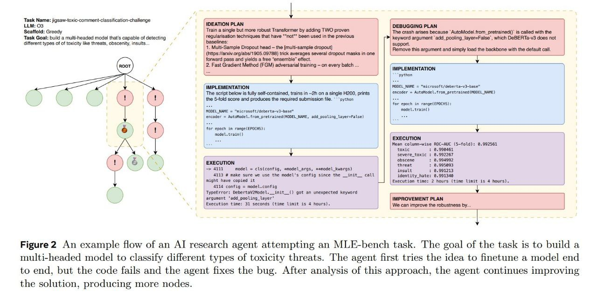
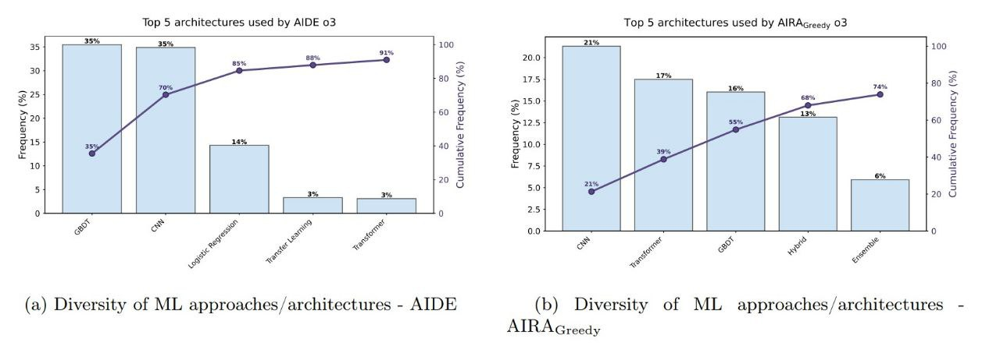
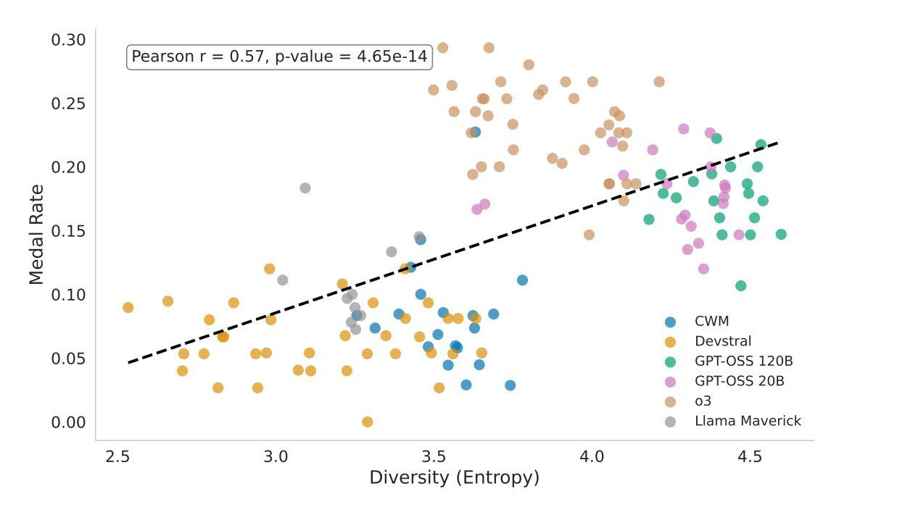

# Разнообразие идей в ИИ-исследовательских агентах: Что делает хорошего ИИ-исследовательского агента?

## Краткое описание

ИИ-исследовательские агенты обещают ускорить научный прогресс, автоматизируя проектирование, реализацию и обучение моделей машинного обучения. Однако, ключевые факторы, определяющие успех или неудачу траекторий агентов, до сих пор не до конца понятны. В статье "What Does It Take to Be a Good AI Research Agent? Studying the Role of Ideation Diversity" изучается роль, которую разнообразие идей играет в производительности агентов.

## Основные выводы исследования

### Разнообразие идей напрямую влияет на результативность

Исследование выявило сильную корреляцию между разнообразием идей агента и его конечным результатом. Чем больше идей и их разнообразие, тем лучше. Это справедливо для всех моделей и всех абляционных исследований.

### Анализ траекторий агентов

Исследователи протестировали 7 разных LLM на логах агента, решающего MLE-bench:

- **MLE-bench** — основной бенчмарк для оценки агентов, решающих задачи машинного обучения
- В нем агенты должны соревноваться с существующими решениями людей в Kaggle-соревнованиях
- Когда агент получает задачу (набор данных, метрику, скрипты для оценки решения), ему остается предложить и написать полноценный пайплайн — от обработки данных до обучения модели, которая будет лучше существующих решений

**Описание:** На изображении показан пример потока работы ИИ-исследовательского агента, пытающегося выполнить задачу MLE-bench. Цель задачи - построить многоголовую модель для классификации различных типов угроз токсичности. Агент сначала пробует идею дообучения модели от начала до конца, но код не работает и агент исправляет ошибку. После анализа этого подхода агент продолжает улучшать решение, создавая больше узлов.

### Объем исследования

- 75 задач, каждая запускалась с разными сидами 10-20 раз
- Всего корпус из 11 000 траекторий агентов
- Примерно 1 200 000 отдельных нод графа решений
- 264 000 GPU-часов

## Сcaffолды и их влияние на разнообразие идей

Используются два альтернативных скаффолда (логики агента):

1. **AIDE** - один из подходов к агентной архитектуре
2. **AIRA-dojo** - MCTS и Greedy (Multi-armed Bandit Monte Carlo Tree Search)

Ключевые наблюдения:
- Разные скаффолды дают не только разное разнообразие идей, но и разное распределение частотности идей у одних и тех же моделей
- AIRA-dojo в целом позволяет держать распределение более равномерным
- AIDE результат больше похож на закон Ципфа (меньше разнообразия)

**Описание:** На изображении показано сравнение распределения подходов и архитектур машинного обучения между двумя скаффолдами: AIDE и AIRA-Greedy. Видно, что распределения различаются, что подтверждает, что разные архитектуры агентов по-разному подходят к генерации и реализации идей.

## Контроль разнообразия идей

Существует несколько способов контролировать и увеличивать разнообразие идей:

- **Изменение температуры**: Высокая температура приводит к более разнообразным генерациям
- **Системные промпты**: Настройка промптов может влиять на креативность
- **Динамическая генерация**: На следующих этапах просить сгенерировать что-то новенькое
- **Использование судей**: Внедрение оценки качества идей до реализации
- **Искусственное вмешательство**: Повышение или понижение разнообразия для проверки влияния

**Описание:** На изображении показаны различные подходы к генерации идей в ИИ-исследовательских агентах. Разнообразие идей критически важно для достижения лучших результатов, и разные методы могут стимулировать создание более широкого спектра потенциальных решений.

## Промежуточные выводы

- В рамках всевозможных абляционных исследований явно видно, что любые метрики перформанса на MLE-bench сильно коррелируют с более высокой вариативностью идей
- При текущем уровне качества моделей, основной боттлнек - способность писать код и имплементировать идеи
- Гораздо более интересные результаты получаются, когда генерируется больше идей и имплементаций, а не более систематически исследуются гиперпараметры парочки идей

## Текущие ограничения

Основной боттлнек текущих моделей, который часто портит результат - это непосредственно способность писать код, вносить правки и дебажить. Неспособность отдебажить свои же собственные правки - проблема, которая сильнейшим образом занижает общий перформанс относительно всех прекрасных идей. 

Если бы способность писать код была идеальной, результаты относительно того, что важнее: более глубокий перебор гиперпараметров или более поверхностное исследование большего числа идей - могли бы быть пересмотрены.

## Практическое значение

Это исследование дает важное понимание для разработчиков ИИ-исследовательских агентов:

- **Разнообразие идей** должно быть приоритетом при проектировании агентов
- Архитектура агента (в частности выбор скаффолда) влияет на разнообразие идей
- Системы, которые могут оценивать и фильтровать идеи до реализации, как AlphaResearch, могут быть более эффективными
- Качество генерации кода остается ключевым фактором ограничивающим общую результативность

## Связи с другими темами

- [[ai/agents/mle_bench.md|MLE-bench]] - бенчмарк, на котором проводилось исследование
- [[ai/agents/alpharesearch_system.md|AlphaResearch]] - система, которая использует подход оценки идей до реализации
- [[ai/agents/ai_agent_benchmarks.md|Бенчмарки для ИИ-агентов]] - другие оценочные фреймворки
- [[ai/optimization/genetic_algorithms.md|Генетические алгоритмы]] - подход, также использующий разнообразие решений

## Источники

1. [What Does It Take to Be a Good AI Research Agent? Studying the Role of Ideation Diversity](https://arxiv.org/abs/2511.15593) - основная статья, описывающая исследование роли разнообразия идей в ИИ-исследовательских агентах
2. [MLE-bench on Hugging Face](https://huggingface.co/papers/2410.07095) - описание бенчмарка MLE-bench, используемого в исследовании