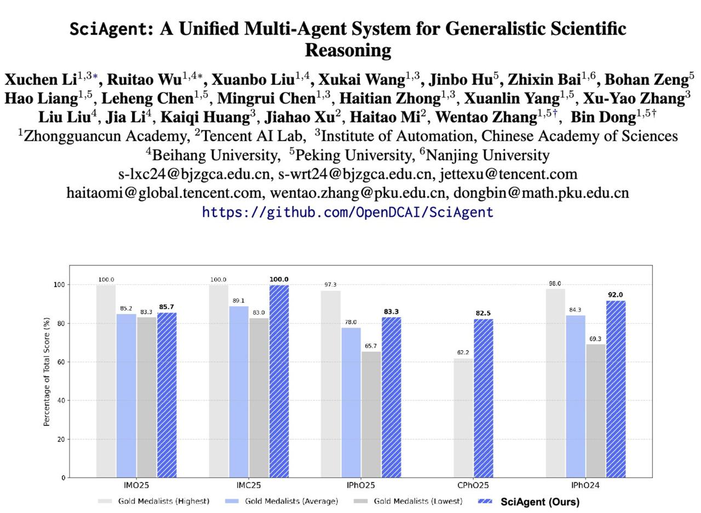

# SciAgent: Единая многоагентная система для научного рассуждения

**Описание:** На изображении представлена архитектура SciAgent - унифицированной многоагентной системы для научного рассуждения. Показано, как координатор взаимодействует с различными специализированными агентами (по математике, физике, химии и другим наукам), которые работают параллельно для решения сложных научных задач. Система демонстрирует динамическую маршрутизацию задач и координацию между различными специализированными компонентами.

## Описание

SciAgent - это передовая многоагентная система, разработанная для научного рассуждения общего характера. Это возможно самая впечатляющая научная ИИ-система на сегодняшний день, способная координировать работу целой команды "мини-агентов", как настоящий научный коллектив.

## Основные характеристики

### Архитектура

- **Координационный агент**: Сверху находится координатор, который понимает, какая задача перед ним: математика, физика, химия, какая сложность, какой тип рассуждений нужен
- **Динамические цепочки рассуждений**: Он сам собирает нужную цепочку рассуждений из разных специализированных агентов
- **Параллельные вычисления**: Специализированные агенты параллельно считают, моделируют, доказывают, проверяют и подстраиваются друг под друга
- **Динамический научный пайплайн**: ИИ строит научный пайплайн *на ходу*, адаптируя его к конкретной задаче

### Принцип работы

SciAgent работает по принципу настоящего научного коллектива:
- Разные агенты специализируются на разных аспектах научных задач
- Координатор анализирует задачу и распределяет её между соответствующими специализированными агентами
- Результаты интегрируются в единый ответ
- Вся система работает параллельно, обеспечивая высокую эффективность

## Результаты и достижения

SciAgent демонстрирует выдающиеся результаты на международных научных соревнованиях:

- 🥇 **IMO 2025**: Уровень золотых медалистов на международной математической олимпиаде
- 💯 **IMC 2025**: Идеальный результат на международном конкурсе математиков
- 🔝 **IPhO 2024/2025**: Практически человеческий топ-уровень на международной физической олимпиаде
- 📈 **CPhO 2025**: Огромный отрыв в результатах (264 против 199 у лучших людей)
- 🧠 **"Экзамен человечества"**: Уверенная работа на задачах высочайшей сложности
- ⚙️ **Полная автоматизация**: Моделирование, вычисления, вывод формул и верификация — всё параллельно

## Значение и влияние

SciAgent представляет новую парадигму научного мышления в ИИ, доказывая, что:

- ИИ может рассуждать не как одиночная модель, а как команда специалистов
- ИИ способен самостоятельно выбирать стратегию решения задачи
- ИИ может использовать различные инструменты и подходы в зависимости от задачи
- ИИ может динамически адаптировать свой процесс мышления к требованиям задачи

Это не просто рост точности на 2%, это качественно новый подход к научному мышлению в ИИ. Если такие системы будут масштабироваться, научные задачи высокого уровня изменятся навсегда.

## Технические аспекты

### Многоагентная координация
SciAgent реализует сложную систему координации между различными специализированными агентами, каждая из которых отвечает за определённый аспект решения научных задач:
- Математические рассуждения
- Физическое моделирование
- Химические вычисления
- Формулирование гипотез
- Проверка результатов
- Верификация выводов

### Параллельная обработка
Все агенты работают параллельно, обмениваясь информацией и результатами промежуточных вычислений, что обеспечивает высокую вычислительную эффективность.

## Применение и перспективы

### Научные исследования
- Автоматизация решения комплексных научных задач
- Поддержка научных открытий и гипотез
- Ускорение научного процесса

### Образование
- Система может использоваться как инструмент для обучения научному мышлению
- Помощь в решении сложных задач в различных научных дисциплинах

### Промышленность
- Моделирование сложных систем
- Инженерные расчёты
- Научно-исследовательская деятельность

## Связи с другими темами

- [[ai/agents/multi_model_orchestrators.md]] - Много-модельные оркестраторы, схожий подход к координации различных моделей
- [[ai/reasoning.md]] - Рассуждение в ИИ и цепочки рассуждений, которые используются в SciAgent
- [[math/imo_2025_problem_6.md]] - Пример математической задачи, аналогичной тем, которые решает SciAgent
- [[ai/agents/ai_agent_benchmarks.md]] - Бенчмарки для оценки агентов, включая научные задачи
- [[ai/llm/reasoning/reasoning_benchmarks.md]] - Бенчмарки для оценки способностей к рассуждению в LLM
- [[ai/optimization/mathematical_optimization_problems.md]] - Математические оптимизационные задачи, с которыми может справляться SciAgent

## Источники

1. [SciAgent: A Unified Multi-Agent System for Generalistic Scientific Reasoning](https://arxiv.org/abs/2511.08151) - Основная статья о SciAgent, описывающая архитектуру и результаты системы, достигшие выдающихся показателей на международных научных олимпиадах