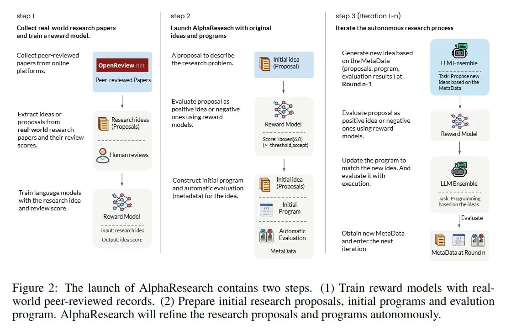

# Симулированное рецензирование в ИИ-исследованиях: Концепция и применение в AlphaResearch

## Общее описание

Симулированное рецензирование (simulated peer review) - это концепция, при которой система искусственного интеллекта использует модель вознаграждения, обученную на реальных научных рецензиях, для оценки качества, новизны и научной ценности идей до их реализации. Эта концепция была реализована в системе AlphaResearch через модель AlphaResearch-RM, обученную на более чем 24,000 реальных рецензиях с конференции ICLR.

**Описание:** Процесс симулированного рецензирования в ИИ-исследованиях, показывающий как система оценивает идеи до их реализации.

## Определение и суть

Симулированное рецензирование - это:

- **Автоматизированный процесс оценки**: использование языковых моделей для имитации человеческого процесса рецензирования
- **Оценка концептуальной ценности**: анализ новизны, строгости и потенциального влияния научных идей
- **Прогнозирование успеха**: предсказание вероятности того, что идея приведет к успешной реализации
- **Фильтрация идей**: отсеивание бесперспективных направлений до ресурсоемкой стадии реализации

## Исторический контекст

### Традиционное рецензирование

В традиционной науке рецензирование (peer review) играет ключевую роль:

- **Качество контроля**: эксперты оценивают научную обоснованность и значимость работы
- **Фильтрация**: низкокачественные или необоснованные работы отсеиваются
- **Улучшение**: авторы получают конструктивные отзывы для улучшения своих работ

### Переход к ИИ-рецензированию

С развитием ИИ возникла возможность автоматизации этого процесса для:

- **Оценки идей до реализации**: экономия вычислительных ресурсов
- **Обработки большого объема гипотез**: масштабирование процесса отбора идей
- **Улучшения фокусировки исследований**: направление усилий на более перспективные идеи

## Применение в AlphaResearch

### Двойная исследовательская среда

В AlphaResearch симулированное рецензирование интегрировано в двойную исследовательскую среду:

1. **Предварительная оценка идей**: каждая новая идея оценивается моделью вознаграждения
2. **Реализация только перспективных идей**: только идеи, прошедшие порог качества, реализуются
3. **Проверка выполнения**: рабочие реализации оцениваются по традиционным метрикам

### Преодоление "разрыва между идеей и выполнением"

Ключевая проблема, которую решает симулированное рецензирование:

- **Системы, фокусирующиеся только на идее**: могут генерировать концепции, которые вычислительно невыполнимы
- **Системы, фокусирующиеся только на выполнении**: могут сходиться к решениям, которые технически корректны, но научно тривиальны
- **Гибридный подход**: сочетание оценки качества идеи с производительностью её реализации

## Архитектура симулированного рецензирования

### Обучающие данные

Система обучается на:

- **Рецензии с ICLR**: 24,445 реальных рецензий за 2017–2024 годы
- **Рейтинги и комментарии**: качественные и количественные оценки от экспертов
- **Решения о принятии**: информация о том, были ли работы приняты/отклонены

### Модель оценки

- **Файнтюны Qwen-2.5-7B-Instruct**: специализированная модель для оценки научных идей
- **Высокая точность**: 72% точности в классификации качества статей (на опережение GPT-5 и людей-аннотаторов)
- **Концептуальная оценка**: способность оценивать новизну, строгость и потенциальное влияние

## Значение и влияние

### Для автоматизированного научного открытия

- **Повышение качества открытий**: акцент на научно ценные, а не просто выполнимые решения
- **Экономия ресурсов**: отсеивание бесперспективных идей до ресурсоемкой реализации
- **Направленное исследование**: фокусировка на более перспективных направлениях

### Для ИИ-науки в целом

- **Масштабируемость**: возможность обработки большого количества гипотез
- **Консистентность оценки**: стандартизированный процесс оценки идей
- **Объективность**: минимизация предвзятости, присущей человеческому рецензированию

## Ограничения и вызовы

### Текущие ограничения

- **Зависимость от обучающих данных**: модель может воспроизводить предвзятости, присутствующие в реальных рецензиях
- **Ограниченная область применения**: эффективность может варьироваться в зависимости от области исследования
- **Необходимость обновления**: модель нуждается в регулярном обновлении по мере развития науки

### Потенциальные проблемы

- **Оценка инновационных идей**: система может отвергать действительно революционные идеи, которые не соответствуют традиционным критериям
- **Баланс между безопасностью и инновациями**: чрезмерная фильтрация может ограничить креативность

## Будущие направления

### Потенциальные улучшения

- **Многоуровневое рецензирование**: оценка на разных уровнях (методология, эксперименты, результаты)
- **Адаптивные критерии**: динамическая настройка критериев оценки в зависимости от области
- **Комбинация ИИ- и человеческого рецензирования**: гибридный подход для максимальной эффективности

### Расширение применения

- **Образование**: автоматическая оценка научных проектов студентов
- **Индустриальные исследования**: оценка R&D идей и проектов
- **Междисциплинарные исследования**: оценка идей, охватывающих несколько областей

## Связи с другими темами

- [[ai/agents/alpharesearch_system.md]] - система, в которой реализована концепция
- [[ai/llm/models/alpharesearch_reward_model.md]] - конкретная модель, реализующая симулированное рецензирование
- [[ai/llm/rlhf.md]] - методы обучения с подкреплением, на которых основаны модели вознаграждения
- [[ai/research_advances/automated_scientific_discovery.md]] - область, в которой применяется концепция
- [[ai/agents/deepevolve_framework.md]] - альтернативный подход к автоматизированному открытию, использующий внешние базы знаний

## Источники

1. [AlphaResearch: Accelerating New Algorithm Discovery with Language Models](https://arxiv.org/abs/2511.08522) - основная статья, в которой представлена концепция симулированного рецензирования в контексте AlphaResearch
2. [ICLR Conference Real Reviews Dataset] - набор данных реальных рецензий, на которых обучена модель
3. [Peer Review Process in Scientific Conferences] - традиционный процесс рецензирования, который имитируется системой