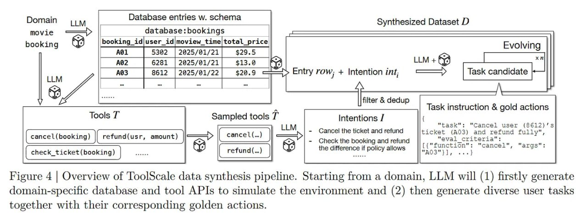

# ToolScale: Синтетический датасет для оркестрации инструментов

## Краткое описание
ToolScale - это синтетический датасет, созданный для обучения оркестраторов в рамках фреймворка ToolOrchestra. Он содержит траектории использования инструментов, созданные с помощью сильных LLM и строгой фильтрации для обеспечения качества.

## Основная информация

### Контекст и проблема
Чтобы обучить умного роутера, нужны данные, а качественных траекторий использования инструментов мало. Традиционные методы сбора данных для обучения оркестрации инструментов сталкиваются с нехваткой размеченных примеров оптимального использования инструментов для решения задач.

### Решение: Pipeline ToolScale
Авторы создали пайплайн ToolScale с несколькими этапами:
1. **Генерация доменных баз данных**: Сначала генерируют доменные базы данных (например, SQL для бронирования билетов)
2. **Создание пользовательских интентов**: Сильная LLM создает пользовательские интенты и "золотые" траектории
3. **Строгая фильтрация**: Если задачу можно решить без инструментов или если "золотая" траектория падает с ошибкой — в корзину

### Архитектура датасета
- **Многоступенчатые задачи**: Содержит задачи, требующие нескольких последовательных вызовов инструментов
- **Многодоменные**: Охватывает различные области знаний и типы инструментов
- **Верифицируемые**: Каждая траектория может быть проверена на корректность выполнения
- **Масштабируемый**: Может быть расширен для новых инструментов и доменов

### Качество данных
Важной особенностью ToolScale является строгая фильтрация:
- Исключаются задачи, которые решаются без использования инструментов
- Проверяется корректность выполнения инструментов в траектории
- Исключаются траектории с ошибками выполнения
- Обеспечивается разнообразие стратегий решения

## Новые концепции и термины

- **ToolScale**: Синтетический датасет для обучения оркестрации инструментов
- **Golden trajectories**: "Золотые" траектории использования инструментов, созданные как эталонные примеры
- **Multi-turn tool calling**: Многошаговое использование инструментов, требующее последовательных вызовов
- **Verifiable tasks**: Задачи, результаты которых могут быть проверены автоматически

## Примеры применения
- Обучение моделей-оркестраторов для выбора между различными инструментами
- Создание обучающих данных для систем маршрутизации запросов
- Генерация эталонных траекторий для оценки эффективности агентов

## Связи с другими темами
- [[toolorchestra_framework.md]] - Фреймворк, для которого был создан датасет
- [[grpo_algorithm.md]] - Алгоритм, использующий данные из ToolScale для обучения
- [[synthetic_data_generation_for_agents.md]] - Общие подходы к генерации синтетических данных для агентов
- [[ai_agent_benchmarks.md]] - Бенчмарки, с которыми сравнивается эффективность

## Источники
1. Su, Hongjin, Diao, Shizhe, Lu, Ximing, et al. "ToolOrchestra: Elevating Intelligence via Efficient Model and Tool Orchestration" (2025). arXiv:2511.21689
2. "ToolScale: Synthetic Dataset for Tool Orchestration" (2025). Hugging Face Dataset: nvidia/ToolScale

## Медиа

**Рисунок 4:** Обзор конвейера синтеза данных ToolScale. Начиная с домена, LLM сначала генерирует доменно-специфичную базу данных и API инструментов для имитации среды, а затем генерирует разнообразные пользовательские задачи вместе с соответствующими золотыми действиями.