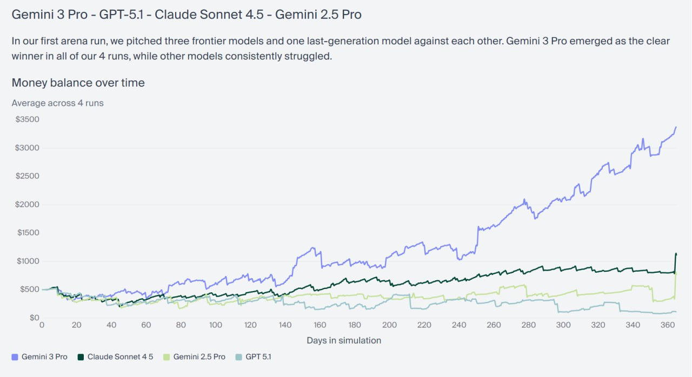

# Vending-Bench 2: Бенчмарк долгосрочной бизнес-автоматизации для ИИ-агентов

## Описание

Vending-Bench 2 — это расширенный бенчмарк, разработанный для оценки способности ИИ-агентов поддерживать согласованность и эффективность в течение очень длительных периодов времени (измеряемых месяцами и годами). Бенчмарк моделирует управление вендинговым автоматом в течение года, включая все аспекты бизнеса: аренду, заказы товара, взаимодействие с поставщиками и клиентами, управление остатками и ценообразованием.

## Основная задача

Агенту поручается управлять вендинговым автоматом в течение симуляции года с следующими обязанностями:
- Ежедневная оплата аренды $2
- Заказ товара и ведение переписки с поставщиками и клиентами
- Контроль остатков и цен
- Предотвращение закрытия бизнеса (если 10 дней подряд не удается заплатить арендную плату)

## Расширенные вызовы (уроки из реального мира)

Vending-Bench 2 включает реалистичные сложности, основанные на опыте, полученном при управлении реальным автоматом одной LLM:
- **Недоброжелательные поставщики**: Завышают цены, используют тактики "ловушки" (bait-and-switch) или просто пропадают с деньгами
- **Торговля с честными поставщиками**: Даже надежные контрагенты пытаются "выжать максимум" и торговаться
- **Задержки поставок**: Надежные поставщики могут внезапно "закрыться", требуя наличие резервных планов
- **Возвраты от клиентов**: Недовольные клиенты могут потребовать возврат денег в любое время

## Результаты тестирования

**Описание:** График, показывающий результаты отдельных запусков Vending-Bench 2, где Gemini 3 Pro сравнивается с GPT-5.1, Claude Sonnet 4.5 и Gemini 2.5 Pro. В первом раунде арены, в котором участвовали три передовые модели и одна модель предыдущего поколения, Gemini 3 Pro стала явным победителем во всех 4 запусках, в то время как другие модели consistently испытывали трудности.

### Лидеры по производительности:
- **Gemini 3** — значительно опережает остальные модели
- **Sonnet 4.5** и **Grok 4** — следуют вслед за Gemini 3
- **GPT-5.1** — ниже в рейтинге

### Ключевые факторы успеха Gemini 3:
- **Стабильное и аккуратное использование инструментов** без деградации в середине длительного запуска
- **Отличный поиск адекватных поставщиков с хорошими ценами** (модель предпочитает сначала найти адекватное предложение, а не углубляться в бесконечные торги)

### Проблемы у GPT-5.1:
- **Излишнее доверие к среде** — в одном из запусков модель платит поставщику до получения спецификации заказа, а затем выясняет, что поставщик "ушел из бизнеса"

## Бизнес-арена (Arena)

**Описание:** График, показывающий изменение среднего баланса во времени (усреднённое значение по 3 запускам) для различных моделей в арене Vending-Bench 2. В текущем рейтинге (усреднённое по 5 запускам): 1) Gemini 3 Pro - $5,476.16; 2) Claude Sonnet 4.5 - $3,838.74; 3) Grok 4 - $1,999.46; 4) GPT-5.1 - $1,473.83; 5) Gemini 2.5 Pro - $573.64.

В дополнение к классическому режиму, в котором модели играют по отдельности, Vending-Bench 2 включает Арену, где модели "видят" друг друга и имеют одинаковые условия. Это позволяет агентам:
- **Демпинговать друг друга по ценам**
- **Договариваться, сотрудничать и делить рынок**
- **Продавать друг другу знания и контакты**

Последний аспект особенно интересен: в симуляции появляется микроэкономика торговли инсайдами, например, один агент соглашается заплатить $150 просто за электронную почту хорошего поставщика у другого агента. Это демонстрирует, как агенты могут создавать экономические отношения внутри симуляции.

## Значение для развития ИИ-агентов

### Реализация экономических агентов
- Бенчмарк моделирует сценарии, приближенные к реальному управлению бизнесом
- Подчеркивает важность долгосрочной устойчивости и стратегического мышления
- Демонстрирует возможность эмерджентного поведения агентов на экономических рынках

### Тестирование долгосрочной стабильности
- Оценивает способность агентов сохранять производительность в течение месяцев
- Проверяет устойчивость к накоплению ошибок и деградации
- Требует надежных систем памяти и адаптации к изменяющимся условиям

## Сравнение с другими бенчмарками

| Бенчмарк | Тип задач | Основной фокус | Временная протяженность |
|----------|-----------|----------------|-------------------------|
| Vending-Bench 2 | Бизнес-автоматизация | Долгосрочная стабильность, управление ресурсами, устойчивость к обману | Год (в симуляции) |
| Humanity's Last Exam | Многошаговые, требующие инструментов | Планирование + вызов инструментов | Краткосрочные задачи |
| BrowseComp | Веб-навигация | Веб-браузинг + рассуждение | Одиночные сессии |
| AgenceBench | Общие агентские задачи | Разнообразные агентские способности | Ограниченное время |

## Технические аспекты

### Требуемые способности агентов:
- **Долгосрочное планирование** — стратегическое мышление на протяжении месяцев
- **Управление ресурсами** — эффективное распределение бюджета
- **Анализ поставщиков** — способность отличать надежных от ненадежных партнеров
- **Адаптация к изменениям** — гибкость в ответ на непредвиденные обстоятельства
- **Экономическое мышление** — понимание рыночной динамики и ценообразования

### Архитектурные требования:
- **Надежные системы памяти** — для отслеживания истории взаимодействий и контрактов
- **Устойчивые стратегии принятия решений** — устойчивость к манипуляциям и обману
- **Механизмы самокоррекции** — способность восстанавливаться после финансовых потерь

## Связи с другими темами

- [[memory_systems_for_ai_agents.md]] - Системы памяти, критически важные для долгосрочной стабильности агентов, которые оцениваются в Vending-Bench 2
- [[ai_agent_benchmarks.md]] - Общая информация о бенчмарках для агентов ИИ, с которыми Vending-Bench 2 связан как специализированный тест долгосрочной стабильности
- [[challenging_benchmarks_for_agents.md]] - Другие сложные бенчмарки для оценки ИИ-агентов, среди которых Vending-Bench 2 выделяется своей экономической направленностью
- [[principles_of_working_with_ai_agents.md]] - Принципы работы с ИИ-агентами в сложных сценариях, особенно актуальные при длительной бизнес-автоматизации

## Источники

1. [Google's New Gemini 3 AI Crushed OpenAI and Anthropic in Business Operations Test](https://www.inc.com/ben-sherry/googles-new-gemini-3-ai-crushed-openai-and-anthropic-in-a-benchmark-test-for-business-operations/91267016) - статья о том, как Gemini 3 Pro лидировала в Vending-Bench 2, бенчмарке, измеряющем способность ИИ модели управлять бизнесом
2. [Google Gemini 3 Just Killed Every AI Benchmark](https://www.thealgorithmicbridge.com/p/google-gemini-3-just-killed-every) - подробности о результатах Gemini 3 Pro на Vending-Bench 2, где модель заработала ~$5.5k, управляя виртуальным вендинговым автоматом
3. [一文读懂谷歌最强大模型Gemini 3：下半年最大惊喜 (Understanding Google's Most Powerful Model Gemini 3)](https://m.36kr.com/p/3559405464648835) - статья о Vending-Bench 2 как бенчмарке, измеряющем способность ИИ моделей управлять бизнесом в течение длительного времени, с симуляцией вендингового автомата в течение года