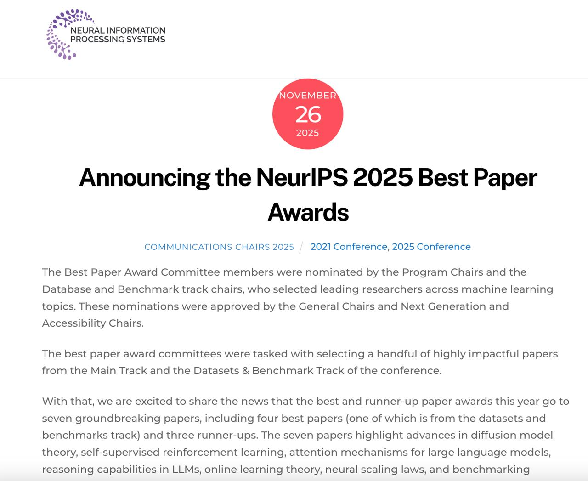

# NeurIPS 2025: Обзор ключевых наград

 <!-- TODO: Broken image path -->

**Изображение:** Анонс NeurIPS 2025 Best Paper Awards - перечень семи прорывных статей включает достижения в теории диффузионных моделей, самообучении с подкреплением, механизмах внимания для больших языковых моделей, возможностях рассуждения в LLM, теории онлайн-обучения, масштабировании нейронных сетей и бенчмаркинге.

## Краткое описание

NeurIPS (Conference on Neural Information Processing Systems) 2025 — одна из самых престижных конференций в области машинного обучения и нейроинформатики. В 2025 году были объявлены победители различных номинаций, отражающих ключевые тренды: масштабирование моделей, устойчивость обучения и фундаментальные теоретические результаты.

## Основная информация

Общий тренд в наградах NeurIPS 2025 — это работы, посвященные:
- Масштабированию архитектур моделей
- Устойчивости и стабильности процесса обучения
- Фундаментальным теоретическим результатам в теории машинного обучения

## Специальные награды

### Test of Time Award (2015)

**Faster R-CNN** — работа, в которой была представлена RPN (Region Proposal Network), заменившая Selective Search и сделавшая детекцию объектов полностью end-to-end. Эта работа задала стандарт индустрии на десятилетие.

**Вклад:**
- Введение RPN для генерации предложений регионов
- Полностью дифференцируемый процесс детекции
- Установление новых стандартов в задачах компьютерного зрения

### Sejnowski–Hinton Prize (2016)

**Feedback Alignment** — работа, показавшая, что backpropagation работает даже при случайных фиксированных обратных весах. Это решает проблему транспорта весов (weight transport problem) и делает алгоритм ближе к биологически правдоподобным процессам обучения.

**Вклад:**
- Показаны альтернативные механизмы обратного распространения
- Решение проблемы синхронизации весов в биологических системах
- Приближение к биологически правдоподобным алгоритмам обучения

## Лучшие работы (Main Track)

### Архитектура: Gated Softmax Attention

**Проблема:** Нестабильность больших трансформеров и проблема attention sinks (нестабильности, связанные с чрезмерным вниманием к отдельным токенам).

**Решение:** Добавление простого sigmoid-гейтирования для отдельных голов внимания (attention heads). Этот механизм обеспечивает стабильность почти без вычислительных издержек.

**Применение:** Уже используется в Qwen3-Next.

**Преимущества:**
- Повышенная стабильность при обучении больших моделей
- Минимальные вычислительные издержки
- Улучшенная масштабируемость архитектур

### Обучение с подкреплением: Масштабирование до 1024 слоёв

**Self-Supervised RL** — позволил обучать сеть глубиной 1024 слоя, что ранее было невозможно для стандартных подходов. На задачах локомоции достигнуто улучшение до 50× по сравнению с обычными моделями.

**Преимущества:**
- Возможность обучения экстремально глубоких сетей
- Значительное улучшение производительности
- Применение к задачам, где глубокие архитектуры особенно полезны

### Теория: Динамика диффузии

**Исследование фаз обучения диффузионных моделей:** выделены две фазы:
1. Быстрая фаза обобщения (generalization)
2. Медленная фаза запоминания (memorization)

**Вклад:** Формализация implicit regularization, объясняющая поведение диффузионных моделей.

### Большие языковые модели: Artificial Hivemind

**Исследование конвергенции ответов LLM:** Анализ того, как разные LLM начинают давать схожие ответы, что может свидетельствовать о потере разнообразия. Это исследование подробно описано в [[../../ai/llm/artificial_hivemind/index.md|Искусственном Роевом Разуме]].

**Новый датасет:** Infinity-Chat — создан для изучения эффекта hivemind и потери разнообразия в ответах LLM. Подробнее о датасете в [[../../ai/llm/artificial_hivemind/infinity_chat_dataset.md|датасете INFINITY-CHAT]].

**Проблемы:**
- Уменьшение разнообразия ответов
- Потенциальные проблемы с независимостью рассуждений
- Необходимость в новых подходах к разнообразию генерации

### Теория: Разрыв в онлайн-обучении

**Результат:** Доказан квадратичный разрыв в sample complexity между трансдуктивным и обычным онлайн-обучением.

**Значение:** Закрытие старой теоретической задачи, уточняющее границы возможностей методов онлайн-обучения.

## Контекст и значение

NeurIPS 2025 подчеркивает несколько важных направлений:
- **Стабильность и масштабируемость:** Упор на стабильность обучения больших архитектур
- **Теоретические основы:** Развитие фундаментальных теорий обучения
- **Междисциплинарность:** Связь с биологией, физикой и другими науками
- **Практическая применимость:** Решения, которые могут быть применены в реальных системах

## Примеры применения

- Разработка стабильных архитектур трансформеров
- Создание глубоких сетей для задач управления
- Понимание динамики обучения диффузионных моделей
- Предотвращение эффекта "hivemind" в LLM

## Связи с другими темами

- [[../nlp/transformers/transformer_architecture.md]] - Основы архитектуры трансформеров
- [[../nlp/transformers/next_gen_transformer_architectures.md]] - Следующее поколение архитектур трансформеров
- [[../llm/specialized_attention_mechanisms.md]] - Специализированные механизмы внимания
- [[../reinforcement_learning/deep_rl/deep_rl_algorithms.md]] - Алгоритмы глубокого обучения с подкреплением
- [[../computer_vision/diffusion_transformer.md]] - Диффузионные трансформеры
- [[../computer_vision/vision_transformer.md]] - Визионные трансформеры
- [[../llm/reasoning/reasoning_benchmarks.md]] - Бенчмарки для оценки логического мышления в LLM

## Источники

1. [NeurIPS 2025 Best Paper Awards](https://blog.neurips.cc/2025/11/26/announcing-the-neurips-2025-best-paper-awards/) - Официальный анонс победителей NeurIPS 2025 с перечнем наград и их описаниями